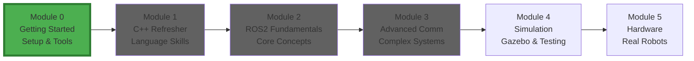
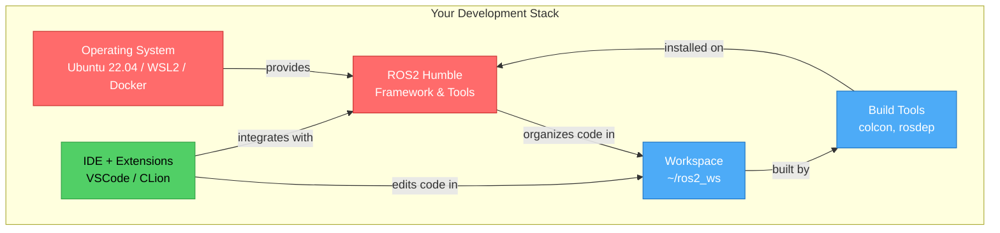
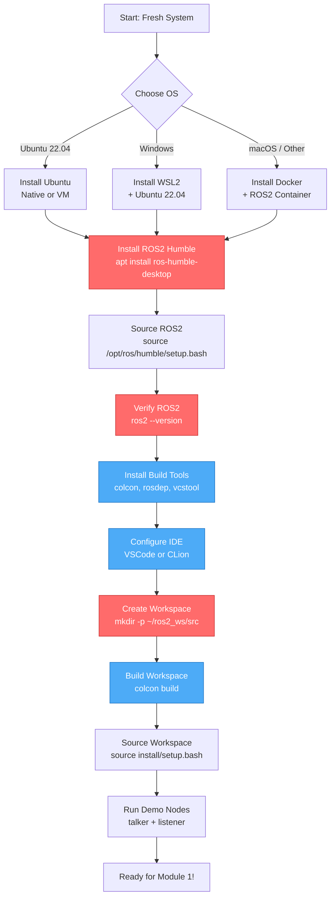
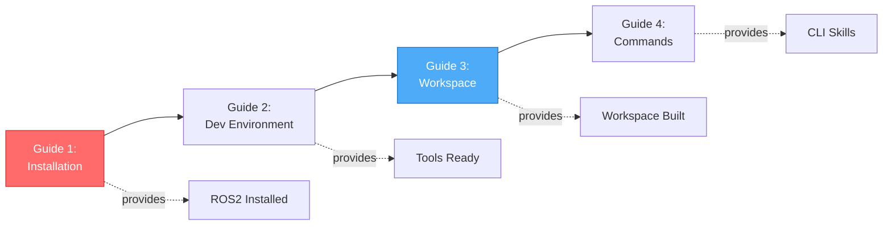
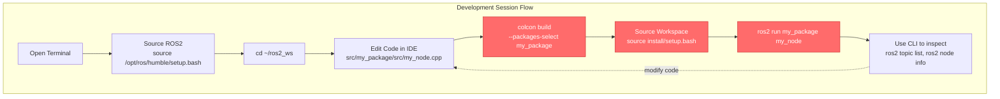

# Module 0: Getting Started

Welcome to the ROS2 and C++ course! This module will help you set up your development environment and get familiar with the essential tools and commands you'll use throughout the course.

## Module Position in Learning Journey



**You are here:** Starting your ROS2 journey with environment setup.

---

## What You'll Learn (Conceptual Overview)

### Development Environment Components Map



### Conceptual Breakdown

#### Operating System (Ubuntu 22.04 / WSL2 / Docker)

**What it is:**
The foundation platform that ROS2 runs on. ROS2 Humble officially supports Ubuntu 22.04 (Jammy Jellyfish), but can also run on Windows via WSL2 or any platform using Docker containers.

**What it does/needed for:**
- Provides the Linux environment required by ROS2
- Manages system packages and dependencies
- Hosts the ROS2 runtime and development tools
- Enables access to hardware (sensors, motors) in production

**Why it matters:**
ROS2 is built for Linux systems, leveraging POSIX standards and Linux tooling. Without a proper OS foundation, you cannot install or run ROS2. Ubuntu 22.04 is the officially supported LTS (Long-Term Support) distribution for ROS2 Humble, ensuring maximum compatibility and community support. Choosing the right OS setup affects everything: performance, compatibility, ease of debugging, and access to learning resources.

**How it connects:**
- Prerequisite for: ROS2 installation, all development tools
- Affects: Package management, hardware access, build performance
- Alternatives: Native Ubuntu (recommended), WSL2 (Windows), Docker (cross-platform)
- Prepares for: Installing ROS2 framework and creating workspaces

---

#### ROS2 Installation (Humble Hawksbill)

**What it is:**
The Robot Operating System 2 framework and its associated packages installed on your system. Humble Hawksbill is the LTS release supported until 2027, located in `/opt/ros/humble/`.

**What it does/needed for:**
- Provides core ROS2 libraries (rclcpp, rclpy)
- Installs command-line tools (ros2, colcon)
- Supplies standard message types and interfaces
- Enables communication middleware (DDS)
- Manages package dependencies

**Why it matters:**
ROS2 is the entire framework you'll be programming against. Every node you write will `#include <rclcpp/rclcpp.hpp>` and link against ROS2 libraries. Without ROS2 installed and sourced, none of your robot code will compile or run. The choice of distribution (Humble in our case) determines which features are available and how long you'll receive updates. A broken or incorrectly configured ROS2 installation means hours of frustrating debugging.

**How it connects:**
- Builds on: Operating system (Ubuntu, WSL2, Docker)
- Required by: All ROS2 packages, your custom nodes
- Sourced via: `source /opt/ros/humble/setup.bash`
- Prepares for: Creating workspaces, building packages (Module 2)

---

#### Workspace Structure (~/ros2_ws)

**What it is:**
A directory structure for organizing, building, and installing ROS2 packages. The standard workspace has four directories: `src/` (source code), `build/` (compilation artifacts), `install/` (executables), and `log/` (build logs).

**What it does/needed for:**
- Organizes your ROS2 packages and source code
- Separates source code from build artifacts
- Provides a location for colcon to build packages
- Creates overlay environments on top of ROS2 base
- Enables modular development (multiple packages per workspace)

**Why it matters:**
Every ROS2 developer works in workspaces. This is where you'll spend 90% of your development time—writing code in `src/`, building with `colcon build`, and sourcing `install/setup.bash` to run your nodes. Understanding workspace overlays (how your workspace builds on top of `/opt/ros/humble/`) is critical for managing dependencies and avoiding conflicts. Workspaces enable you to work on multiple projects without interference.

**How it connects:**
- Builds on: ROS2 installation (base environment)
- Contains: Your packages (Module 2+)
- Built by: colcon build tool
- Sourced in: Every terminal session
- Prepares for: Creating packages, building nodes

---

#### Build Tools (colcon, rosdep)

**What it is:**
Command-line utilities for building ROS2 packages and managing dependencies.
- **colcon**: Build tool that compiles C++ code, processes CMakeLists.txt, and creates install space
- **rosdep**: Dependency manager that installs required system packages

**What it does/needed for:**
- **colcon**: Compiles your C++ nodes, runs tests, builds multiple packages in parallel
- **rosdep**: Automatically installs Ubuntu packages required by ROS2 packages (e.g., Eigen, Boost)
- Manages build order based on package dependencies
- Creates setup scripts for sourcing workspaces
- Enables incremental builds (only rebuild changed packages)

**Why it matters:**
You cannot run ROS2 C++ code without compiling it first, and colcon is the standard build tool for ROS2. Every time you write or modify a C++ node, you'll run `colcon build` to compile it. Rosdep saves you hours by automatically resolving and installing system dependencies—without it, you'd manually hunt for missing libraries. Understanding colcon flags (`--packages-select`, `--symlink-install`) significantly speeds up development iteration.

**How it connects:**
- Builds on: ROS2 installation, workspace structure
- Used by: Every C++ package you create
- Required before: Running any custom node
- Related to: CMake (underlying build system), package.xml (dependencies)
- Prepares for: Building your first node (Module 2, Lesson 3)

---

#### IDE Configuration (VSCode / CLion)

**What it is:**
An Integrated Development Environment configured with C++ support, ROS2 extensions, and code intelligence features (autocomplete, go-to-definition, error highlighting).

**What it does/needed for:**
- Provides syntax highlighting for C++ and CMake
- Offers autocomplete for ROS2 APIs (`rclcpp::Node`, message types)
- Enables go-to-definition for jumping to ROS2 source code
- Integrates debugging tools (gdb, breakpoints)
- Manages build tasks and terminal integration
- Formats code and catches errors before compilation

**Why it matters:**
While you *can* write ROS2 code in a plain text editor, a configured IDE boosts productivity by 10x. Autocomplete helps you discover ROS2 APIs without memorizing documentation. Go-to-definition lets you read ROS2 source code to understand how things work. Debugging integration is essential for tracking down runtime errors. Without a proper IDE setup, you'll waste time on typos, syntax errors, and hunting for function signatures. This is especially critical for students new to C++.

**How it connects:**
- Builds on: Operating system, ROS2 installation
- Integrates with: Workspace, build tools (colcon)
- Optional but: Highly recommended for productivity
- Prepares for: Writing C++ nodes (Module 1, Module 2)
- Not required for: Running pre-built packages

---

## Setup Workflow Visualization



---

## Learning Objectives

By the end of this module, you will be able to:
- ✓ Install ROS2 Humble on Ubuntu, Windows (WSL2), or Docker
- ✓ Configure VSCode or CLion for C++ and ROS2 development
- ✓ Create and build ROS2 workspaces using colcon
- ✓ Execute basic ROS2 commands (`ros2 run`, `ros2 topic`, `ros2 node`)
- ✓ Run and inspect ROS2 nodes and topics
- ✓ Understand the relationship between OS, ROS2, workspace, and tools

---

## Module Structure

### Guides Overview Flow



**Critical path:** Installation → Workspace creation → Verification

### Detailed Guide List

#### 1. [Installation Guide](installation-guide.md)

**What:** Step-by-step instructions for installing ROS2 Humble Hawksbill on your operating system.

**Why:** ROS2 must be installed before any development can begin. This guide ensures you have a working ROS2 installation.

**Key Topics:**
- Ubuntu native installation via apt
- Windows WSL2 setup + ROS2
- Docker containerized setup (cross-platform)
- Verifying ROS2 installation

**Builds on:** Basic Linux command-line skills

**Prepares for:** All subsequent guides and modules

**Time:** 1-2 hours

---

#### 2. [Development Environment Setup](dev-environment-setup.md)

**What:** Configuration guide for IDEs and essential development tools.

**Why:** A properly configured IDE boosts productivity and makes learning C++ and ROS2 significantly easier.

**Key Topics:**
- VSCode installation and C++ extensions
- ROS2-specific VSCode extensions
- CLion configuration (alternative IDE)
- Installing colcon, rosdep, vcstool
- Git configuration for version control

**Builds on:** ROS2 installation (Guide 1)

**Prepares for:** Writing and editing C++ code (Module 1, Module 2)

**Time:** 1 hour

---

#### 3. [ROS2 Workspace Guide](ros2-workspace-guide.md)

**What:** Comprehensive explanation of ROS2 workspace structure and the colcon build system.

**Why:** Workspaces are where all ROS2 development happens. Understanding workspace anatomy is fundamental to managing projects.

**Key Topics:**
- Workspace anatomy (src/, build/, install/, log/)
- Creating your first workspace
- Building packages with colcon
- Sourcing workspaces (`source install/setup.bash`)
- Workspace overlays (your workspace on top of /opt/ros/humble/)
- colcon build flags

**Builds on:** ROS2 installation, development tools

**Prepares for:** Creating packages (Module 2, Lesson 2), building nodes (Module 2, Lesson 3)

**Time:** 1 hour

---

#### 4. [First Commands](first-commands.md)

**What:** Essential ROS2 CLI commands cheat sheet and practical usage guide.

**Why:** ROS2 CLI tools are used daily for running, inspecting, and debugging nodes. Mastering these commands is essential for effective development.

**Key Topics:**
- Running nodes (`ros2 run`)
- Inspecting topics (`ros2 topic list`, `ros2 topic echo`)
- Inspecting services (`ros2 service list`, `ros2 service call`)
- Inspecting nodes (`ros2 node list`, `ros2 node info`)
- Launching multiple nodes (`ros2 launch`)
- Debugging tools (`ros2 doctor`, `ros2 wtf`)

**Builds on:** ROS2 installation, workspace setup

**Prepares for:** Running and debugging your own nodes (Module 2+)

**Time:** 30 minutes

---

## How All Setup Components Work Together



**Typical workflow:**
1. Source ROS2 base environment
2. Navigate to workspace
3. Edit code in IDE
4. Build with colcon
5. Source workspace overlay
6. Run and test with CLI commands
7. Repeat!

---

## Prerequisites

### Hardware Requirements
- **RAM**: 8GB minimum (16GB recommended for smooth IDE performance)
- **Storage**: 50GB free space (20GB for ROS2, 10GB for workspace, 20GB for IDE and tools)
- **Processor**: Modern CPU (Intel i5/Ryzen 5 or better)

### Software Prerequisites
- **Operating System**: One of:
  - Ubuntu 22.04 (Jammy Jellyfish) - **Recommended** for beginners
  - Windows 10/11 with WSL2 - Good for Windows users
  - macOS with Docker - For experienced users
- **Internet connection** for downloading packages (~4GB download)
- **Basic command line skills** (cd, ls, mkdir, rm)

### Knowledge Prerequisites
- Basic programming experience in any language (Python, Java, JavaScript, etc.)
- Familiarity with terminal/command line interface
- Understanding of basic Linux commands
- **Not required:** Previous C++ or ROS experience

---

## Connection to Previous Modules

**This is Module 0 - the starting point!**

There are no previous modules. This module provides the foundation for all subsequent learning. You cannot proceed to Module 1 or Module 2 without a working ROS2 development environment.

---

## Connection to Next Modules

### To Module 1: C++ Refresher

**What Module 0 provides:**
- Working ROS2 installation with compiler toolchain
- IDE configured for C++ development
- Workspace for practicing C++ code
- Build tools (colcon, CMake) for compiling C++ programs

**What Module 1 will teach:**
- C++ language features needed for ROS2 (classes, smart pointers, lambdas)
- Object-oriented programming patterns
- Modern C++17 features
- Building C++ programs with CMake

**Bridge:** Your IDE and workspace from Module 0 will be used to write and compile all C++ examples in Module 1.

### To Module 2: ROS2 Fundamentals

**What Module 0 provides:**
- ROS2 framework installed and verified
- Workspace structure understood
- CLI commands for running and inspecting nodes
- Build system (colcon) ready for compiling ROS2 packages

**What Module 2 will teach:**
- Creating ROS2 nodes in C++
- Publishers, subscribers, services
- Parameters, logging, timers
- Building multi-node systems

**Bridge:** Every ROS2 node you create in Module 2 will be built in the workspace you set up in Module 0, using the colcon commands you learned here.

---

## Conceptual Bridges

### Why Setup Comes First

Many courses dive straight into programming, but ROS2 has specific tooling requirements. Without a proper foundation, you'll hit cryptic errors like:
- `bash: ros2: command not found` (ROS2 not sourced)
- `No module named 'rclcpp'` (ROS2 not installed)
- `colcon: command not found` (Build tools missing)
- `Cannot find package 'my_package'` (Workspace not sourced)

Module 0 eliminates these frustrations by establishing a solid environment. Think of it as building the workshop before you start crafting.

### From Environment to Programming

**Module 0 (Setup)** → **Module 1 (C++)** → **Module 2 (ROS2)**

This progression is intentional:
1. **Module 0:** You install the tools and learn the workspace structure
2. **Module 1:** You learn C++ syntax and patterns in isolation
3. **Module 2:** You combine C++ knowledge with ROS2 APIs to build robot software

Each module builds incrementally. By the end of Module 2, you'll be writing C++ ROS2 nodes that publish data, subscribe to topics, and provide services—all running in the workspace you created in Module 0.

---

## Critical Concepts to Master

Before moving to Module 1, you must master these concepts:

### 1. ROS2 Sourcing
**Concept:** `source /opt/ros/humble/setup.bash` makes ROS2 commands available in your terminal.

**How to verify:** Run `ros2 --version` successfully

**Why critical:** Without sourcing, nothing ROS2-related works

---

### 2. Workspace Sourcing
**Concept:** `source ~/ros2_ws/install/setup.bash` makes your custom packages available.

**How to verify:** Build a workspace, source it, run a custom node

**Why critical:** Every custom package requires workspace sourcing

---

### 3. Colcon Build
**Concept:** `colcon build` compiles all C++ packages in your workspace.

**How to verify:** Run `colcon build` in an empty workspace without errors

**Why critical:** You cannot run C++ code without compiling it first

---

### 4. Package Location
**Concept:** Source code goes in `~/ros2_ws/src/`, executables appear in `~/ros2_ws/install/`.

**How to verify:** Create a package in `src/`, build, find executable in `install/`

**Why critical:** Understanding this separation is key to managing projects

---

## Getting Started Checklist

Follow these steps in order:

- [ ] **Step 1**: Read through this README and understand the conceptual overview
- [ ] **Step 2**: Follow the [Installation Guide](installation-guide.md) for your OS
- [ ] **Step 3**: Verify ROS2 installation works (`ros2 --version`)
- [ ] **Step 4**: Set up your [Development Environment](dev-environment-setup.md)
- [ ] **Step 5**: Create a workspace following [ROS2 Workspace Guide](ros2-workspace-guide.md)
- [ ] **Step 6**: Practice commands from [First Commands](first-commands.md)
- [ ] **Step 7**: Run the verification tests below
- [ ] **Step 8**: Answer verification questions to test understanding

---

## Verification Tests

After completing the setup, verify everything works:

### Test 1: ROS2 Installation
```bash
# Check ROS2 version
ros2 --version

# Should output: ros2 cli version: X.Y.Z
```

**Expected result:** Version information displayed

**If it fails:** ROS2 not installed or not sourced

---

### Test 2: Run Demo Nodes
```bash
# Terminal 1: Start a talker node
ros2 run demo_nodes_cpp talker

# Terminal 2: Start a listener node
ros2 run demo_nodes_cpp listener
```

**Expected result:** Messages published in Terminal 1, received in Terminal 2

**If it fails:** ROS2 installation incomplete or permissions issue

---

### Test 3: Topic Inspection
```bash
# List active topics (while talker/listener running)
ros2 topic list

# Echo messages from a topic
ros2 topic echo /chatter
```

**Expected result:** `/chatter` topic listed, messages displayed

**If it fails:** Nodes not running or CLI tools not installed

---

### Test 4: Build a Workspace
```bash
# Create and build a workspace
mkdir -p ~/ros2_ws/src
cd ~/ros2_ws
colcon build

# Should complete without errors
```

**Expected result:** `build/`, `install/`, `log/` directories created

**If it fails:** Colcon not installed or missing dependencies

---

### Test 5: Source Workspace
```bash
# Source workspace
source ~/ros2_ws/install/setup.bash

# Check overlay
echo $AMENT_PREFIX_PATH
```

**Expected result:** Path shows both `/opt/ros/humble` and `~/ros2_ws/install`

**If it fails:** Workspace not built or setup.bash not found

---

## Common Questions

### Q1: Do I need to source ROS2 every time I open a terminal?

**A:** Yes, unless you add it to your `~/.bashrc` file:
```bash
echo "source /opt/ros/humble/setup.bash" >> ~/.bashrc
```

This makes sourcing automatic for every new terminal.

---

### Q2: What's the difference between sourcing ROS2 and sourcing my workspace?

**A:**
- **Sourcing ROS2** (`/opt/ros/humble/setup.bash`): Makes base ROS2 commands and packages available
- **Sourcing workspace** (`~/ros2_ws/install/setup.bash`): Makes your custom packages available **and also sources ROS2**

If you source your workspace, you don't need to separately source ROS2.

---

### Q3: Why do I need to rebuild with colcon after changing code?

**A:** C++ is a compiled language. Changes to `.cpp` files don't take effect until you compile them into executables. Python ROS2 nodes don't need rebuilding (unless using `--symlink-install`), but C++ nodes always do.

---

### Q4: Can I use a different IDE like Emacs or Vim?

**A:** Yes! VSCode and CLion are recommended for beginners because of their ROS2 integration, but any editor works. You'll just miss features like autocomplete and go-to-definition.

---

### Q5: I'm on macOS. Do I have to use Docker?

**A:** Not strictly. You can also:
1. Use a Linux VM (VirtualBox, Parallels)
2. Dual-boot Ubuntu
3. Use a cloud development environment

Docker is recommended for macOS because it's the easiest cross-platform solution.

---

### Q6: How much disk space does ROS2 really need?

**A:**
- ROS2 Humble (desktop): ~2GB
- Build tools and dependencies: ~1GB
- Your workspace (grows with packages): 1-10GB
- IDE (VSCode): ~500MB, (CLion): ~2GB

Total: 10-20GB conservatively, 50GB recommended for headroom.

---

## Common Issues and Solutions

### Issue: ROS2 commands not found
**Solution**: Source your ROS2 installation
```bash
source /opt/ros/humble/setup.bash
# Add this to ~/.bashrc to make it permanent
echo "source /opt/ros/humble/setup.bash" >> ~/.bashrc
```

---

### Issue: Colcon build fails
**Solution**: Install colcon and dependencies
```bash
sudo apt update
sudo apt install python3-colcon-common-extensions
```

---

### Issue: Permission denied errors
**Solution**: Check file permissions or use proper sudo
```bash
sudo chown -R $USER:$USER ~/ros2_ws
```

---

### Issue: ros2 run cannot find package
**Solution**: Source your workspace
```bash
source ~/ros2_ws/install/setup.bash
```

---

For more troubleshooting, see [../resources/troubleshooting.md](../resources/troubleshooting.md)

---

## Verification Questions

Before moving to Module 1, answer these questions to verify understanding:

### Question 1
**What command makes ROS2 tools available in your terminal?**

<details>
<summary>Click to reveal answer</summary>

`source /opt/ros/humble/setup.bash`

This command sets environment variables (like PATH) so your shell can find ROS2 executables.
</details>

---

### Question 2
**What are the four directories in a ROS2 workspace, and what is each for?**

<details>
<summary>Click to reveal answer</summary>

1. **src/**: Source code (your packages)
2. **build/**: Compilation artifacts (object files, intermediates)
3. **install/**: Final executables and setup scripts
4. **log/**: Build logs

Only `src/` is committed to version control. The others are generated by `colcon build`.
</details>

---

### Question 3
**Why do you need to source your workspace after building?**

<details>
<summary>Click to reveal answer</summary>

Sourcing `install/setup.bash` updates environment variables so ROS2 knows where to find your custom packages. Without it, `ros2 run my_package my_node` will fail with "package not found."
</details>

---

### Question 4
**What is the difference between /opt/ros/humble/ and ~/ros2_ws/?**

<details>
<summary>Click to reveal answer</summary>

- **/opt/ros/humble/**: System-wide ROS2 installation (base packages, cannot modify)
- **~/ros2_ws/**: Your personal workspace (your packages, overlays on top of base)

Your workspace "extends" the base installation, allowing you to develop custom packages without modifying the system ROS2.
</details>

---

### Question 5
**When do you need to run colcon build?**

<details>
<summary>Click to reveal answer</summary>

Every time you:
- Create a new C++ package
- Modify C++ source code (.cpp, .hpp files)
- Change CMakeLists.txt or package.xml

Python code doesn't require rebuilding if you use `colcon build --symlink-install`, but C++ always does.
</details>

---

## Recommended Installation Path

For beginners, we recommend:
1. **Ubuntu 22.04** (native or VM) - Easiest, most compatible, best documentation
2. **Windows WSL2** - Good for Windows users, nearly native performance
3. **Docker** - For experienced users or macOS, adds complexity

---

## Time Estimate

- **Quick setup** (Ubuntu, experienced users): 2-3 hours
- **Full setup** (Windows WSL2, new users): 4-6 hours
- **Docker setup**: 2-3 hours
- **Troubleshooting buffer**: +1-2 hours

**Total: Half a day to full day** for complete setup and verification.

---

## What's Next?

Once your environment is set up and verified:

### You've Accomplished:
✅ Installed ROS2 Humble on your system
✅ Configured development tools (IDE, colcon, rosdep)
✅ Created and built your first workspace
✅ Learned essential ROS2 CLI commands
✅ Verified everything works with demo nodes

### Next Steps:
1. **Proceed to [Module 1: C++ Refresher](../01-cpp-refresher/)** - Learn C++ features needed for ROS2
2. **Bookmark [First Commands](first-commands.md)** for quick CLI reference
3. **Join ROS community** - [ROS Discourse](https://discourse.ros.org/), [ROS Answers](https://answers.ros.org/)

**You're ready to start programming!** Module 1 will teach you the C++ skills needed to write ROS2 nodes.

---

## Additional Resources

- [ROS2 Official Documentation](https://docs.ros.org/en/humble/)
- [ROS2 Installation Guide](https://docs.ros.org/en/humble/Installation.html)
- [Ubuntu Installation](https://ubuntu.com/tutorials/install-ubuntu-desktop)
- [WSL2 Setup Guide](https://docs.microsoft.com/en-us/windows/wsl/install)
- [Colcon Documentation](https://colcon.readthedocs.io/)
- [ROS2 CLI Cheatsheet](https://github.com/ros2/cheatsheet)

---

## Tips for Success

1. **Don't rush** - A proper setup saves hours of debugging later
2. **Test thoroughly** - Verify each step works before proceeding
3. **Save your commands** - Keep a notes file of useful commands and errors
4. **Ask for help** - Check ROS Answers or Discourse if stuck for >30 minutes
5. **Update regularly** - Keep your system and ROS2 updated with `apt update && apt upgrade`
6. **Use version control** - Initialize git in your workspace from day one

---

**Ready to begin?** Start with the [Installation Guide](installation-guide.md)!
