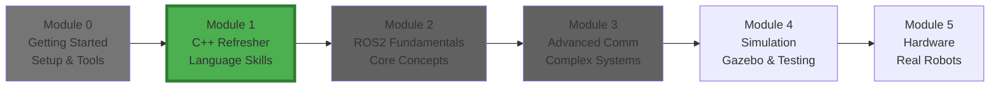
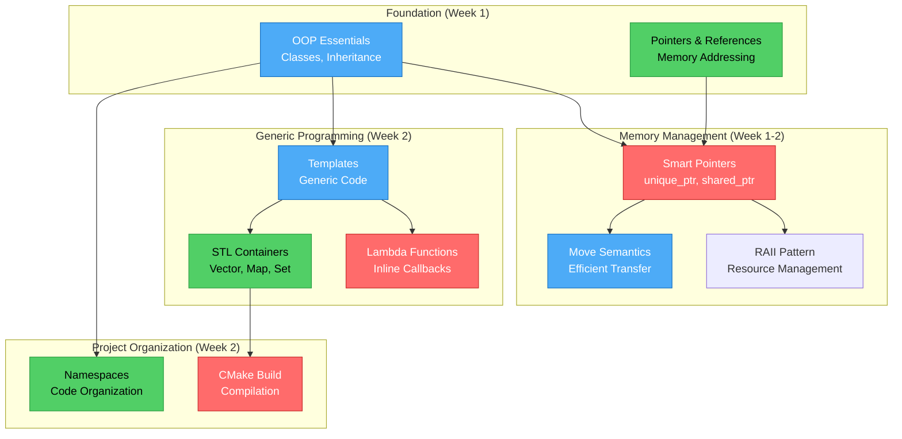
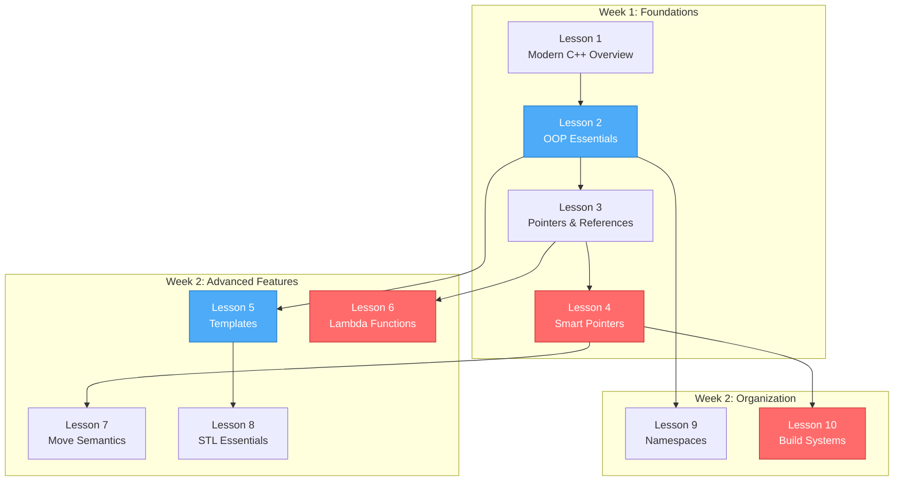
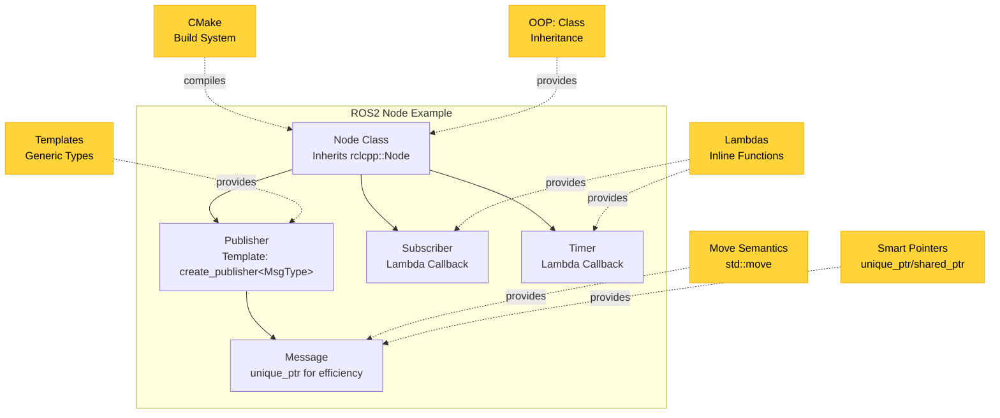

# Module 1: C++ Refresher

Welcome to the C++ Refresher module! This module bridges your Python experience with modern C++ programming, focusing on features essential for ROS2 development.

## Table of Contents

- [Module Position in Learning Journey](#module-position-in-learning-journey)
- [What You'll Learn (Conceptual Overview)](#what-youll-learn-conceptual-overview)
- [Module Overview](#module-overview)
- [Conceptual Breakdown](#conceptual-breakdown)
- [Learning Objectives](#learning-objectives)
- [Prerequisites](#prerequisites)
- [Module Structure](#module-structure)
- [Code Examples](#code-examples-examples)
- [Exercises](#exercises-exercises)
- [Mini-Project: Sensor Data Handler](#mini-project-sensor-data-handler)
- [Connection to Previous Module](#connection-to-previous-module)
- [Connection to Next Module](#connection-to-next-module)
- [Conceptual Bridges](#conceptual-bridges)
- [Study Tips](#study-tips)
- [Key Differences from Python](#key-differences-from-python)
- [Important Concepts for ROS2](#important-concepts-for-ros2)
- [Quick Reference](#quick-reference)
- [Critical Concepts to Master](#critical-concepts-to-master)
- [Module Checklist](#module-checklist)
- [Common Questions](#common-questions)
- [Verification Questions](#verification-questions)
- [Estimated Time](#estimated-time)
- [Resources](#resources)
- [What's Next?](#whats-next)

## Module Position in Learning Journey



**You are here:** Learning C++ features needed for ROS2 development.

---

## What You'll Learn (Conceptual Overview)

### C++ Feature Dependency Map



---

## Module Overview

This module bridges your Python experience with modern C++ programming. Rather than covering all C++ basics, we focus on features you'll **actually use in ROS2 development**, especially those introduced in C++17 and C++20.

**Key Philosophy:** Learn C++ through the lens of ROS2 needs, not generic C++ programming.

---

## Conceptual Breakdown

### Smart Pointers (unique_ptr, shared_ptr, weak_ptr)

**What it is:**
Wrapper classes that automatically manage dynamically allocated memory. `unique_ptr` provides exclusive ownership, `shared_ptr` allows shared ownership with reference counting, and `weak_ptr` breaks circular references.

**What it does/needed for:**
- Automatically deletes objects when they go out of scope (no manual `delete`)
- Prevents memory leaks and dangling pointers
- Expresses ownership semantics in code
- ROS2 nodes are always managed with `shared_ptr`
- Message passing often uses `unique_ptr` for zero-copy transfers

**Why it matters:**
Smart pointers are the **most important C++ feature for ROS2**. Every ROS2 node you create will be a `std::shared_ptr<rclcpp::Node>`. Publishers use `create_publisher<MessageType>()` which returns shared pointers. Efficient message publishing uses `std::unique_ptr` to avoid copying large data. Without understanding smart pointers, you cannot write or read ROS2 code. They eliminate entire classes of bugs (memory leaks, double-free, use-after-free) that plague traditional C++ code.

**How it connects:**
- Builds on: Pointers and references (Lesson 3), RAII pattern
- Used by: ROS2 nodes (Module 2), publishers/subscribers (Module 2)
- Related to: Move semantics (Lesson 7), object ownership
- Prepares for: Creating nodes (Module 2, Lesson 3), message passing

**Example in ROS2:**
```cpp
// Node created with shared_ptr
auto node = std::make_shared<rclcpp::Node>("my_node");

// Efficient message publishing with unique_ptr
auto msg = std::make_unique<std_msgs::msg::String>();
msg->data = "Hello";
publisher_->publish(std::move(msg));  // Zero-copy transfer
```

---

### Lambda Functions

**What it is:**
Anonymous (unnamed) functions defined inline, often used for callbacks. Syntax: `[captures](parameters) { body }`.

**What it does/needed for:**
- Defines callback functions directly at the point of use
- Captures local variables from surrounding scope
- Replaces need for separate callback functions or function objects
- ROS2 uses lambdas extensively for timer callbacks, subscriber callbacks, service handlers

**Why it matters:**
ROS2 callbacks are everywhere: timers, subscriptions, services, actions. Lambda functions let you write these callbacks inline, capturing needed state without creating separate classes or global variables. This is the modern C++ style and makes ROS2 code much cleaner. Compare:

**Without lambda (verbose):**
```cpp
void timer_callback() { /* code */ }
timer_ = create_wall_timer(1s, std::bind(&MyNode::timer_callback, this));
```

**With lambda (clean):**
```cpp
timer_ = create_wall_timer(1s, [this]() { /* code directly here */ });
```

Lambda captures (`[this]`, `[&]`, `[=]`) are critical for accessing node members safely.

**How it connects:**
- Builds on: Functions, closures (conceptually similar to Python)
- Used by: Timers (Module 2, Lesson 11), subscribers (Module 2, Lesson 5), services (Module 2, Lesson 7-8)
- Related to: std::bind (older style), function objects
- Prepares for: Writing concise ROS2 callbacks

---

### Templates

**What it is:**
Generic programming feature that allows writing code that works with any type. Templates are compile-time polymorphism.

**What it does/needed for:**
- Write generic functions/classes that work with multiple types
- ROS2 publishers/subscribers are templated: `create_publisher<MessageType>()`
- Enables type-safe message passing without code duplication
- Allows creating generic sensor handlers, data processors, etc.

**Why it matters:**
The entire ROS2 C++ API (rclcpp) is heavily templated. When you write:
```cpp
publisher_ = create_publisher<std_msgs::msg::String>("topic", 10);
```
You're using a template function (`create_publisher<T>`) with a template parameter (`std_msgs::msg::String`). Understanding template syntax is necessary to read ROS2 API documentation and write custom generic components. Templates enable ROS2 to provide type-safe communication without runtime overhead.

**How it connects:**
- Builds on: Types, generics (similar to Python's type hints but enforced at compile-time)
- Used by: All ROS2 publishers, subscribers, services, actions
- Related to: STL containers (`std::vector<T>`, `std::map<K,V>`)
- Prepares for: Creating publishers/subscribers (Module 2, Lesson 4-5)

---

### Move Semantics (std::move, rvalue references)

**What it is:**
A C++11 feature that enables transferring resources (memory, file handles) from one object to another instead of copying. Uses rvalue references (`T&&`) and `std::move()`.

**What it does/needed for:**
- Avoids expensive copies of large objects (sensor data, images, point clouds)
- Enables zero-copy message passing in ROS2
- Transfers ownership of unique_ptr
- Optimizes performance for large data structures

**Why it matters:**
Robot applications often pass large messages: camera images (megabytes), LiDAR point clouds (millions of points), maps. Copying these is wasteful. Move semantics allows ROS2 to transfer message ownership without copying:
```cpp
auto msg = std::make_unique<sensor_msgs::msg::Image>();
// Fill image data (large!)
publisher_->publish(std::move(msg));  // Transfer ownership, no copy
```
This is critical for real-time performance. Understanding when moves happen vs copies affects system efficiency.

**How it connects:**
- Builds on: Pointers, references, copy constructors
- Used by: Smart pointers, message publishing, STL containers
- Related to: unique_ptr ownership transfer, ROS2 zero-copy
- Prepares for: Efficient message publishing (Module 2, Lesson 4)

---

### Object-Oriented Programming (OOP) Essentials

**What it is:**
Programming paradigm using classes, inheritance, polymorphism. C++ classes encapsulate data and behavior, support inheritance hierarchies.

**What it does/needed for:**
- ROS2 nodes are C++ classes inheriting from `rclcpp::Node`
- Encapsulates node state (publishers, subscribers, timers) as class members
- Enables code reuse through inheritance
- Polymorphism allows overriding virtual functions

**Why it matters:**
Every ROS2 node you write will be a class:
```cpp
class MyNode : public rclcpp::Node {
public:
    MyNode() : Node("my_node") {
        publisher_ = create_publisher<...>(...);
        timer_ = create_wall_timer(...);
    }
private:
    rclcpp::Publisher<...>::SharedPtr publisher_;
    rclcpp::TimerBase::SharedPtr timer_;
};
```
Understanding class construction, member initialization, and inheritance is fundamental. Without OOP knowledge, you cannot structure ROS2 nodes properly.

**How it connects:**
- Builds on: Basic programming concepts (Python classes)
- Foundation for: All ROS2 nodes, custom message types
- Related to: Inheritance (`rclcpp::Node` base class)
- Prepares for: Creating your first node (Module 2, Lesson 3)

---

### CMake Build System

**What it is:**
Cross-platform build system used by ROS2 to compile C++ packages. Configured via `CMakeLists.txt` files.

**What it does/needed for:**
- Specifies how to compile C++ source files
- Links against ROS2 libraries (rclcpp, message packages)
- Defines executables and library targets
- Manages dependencies between packages
- Required for every C++ ROS2 package

**Why it matters:**
You cannot compile ROS2 C++ code without CMake. Every package needs a `CMakeLists.txt`. While colcon handles the build process, CMake defines **what** gets built and **how**. Understanding CMake syntax lets you:
- Add new source files to your package
- Link against additional libraries
- Create multiple executables
- Debug build errors

This is less "programming" and more "build configuration," but equally critical.

**How it connects:**
- Builds on: Module 0 workspace structure, colcon build
- Required for: Every C++ package you create
- Related to: package.xml (ROS2 dependencies)
- Prepares for: Building your first package (Module 2, Lesson 2-3)

---

### STL Containers (vector, map, set)

**What it is:**
Standard Template Library containers for storing collections of data. `std::vector<T>` (dynamic array), `std::map<K,V>` (key-value), `std::set<T>` (unique values).

**What it does/needed for:**
- Store sensor readings, waypoints, object detections
- Manage lists of detected obstacles
- Map robot IDs to states
- Store unique feature IDs
- Efficient data structure operations (search, insert, iterate)

**Why it matters:**
ROS2 messages often contain arrays/lists (e.g., `LaserScan` has `std::vector<float> ranges`). You'll use STL containers constantly:
- Storing historical data for filtering
- Managing queues of commands
- Caching lookup tables
- Accumulating results

STL containers are the C++ equivalent of Python lists and dicts, but statically typed and more performant.

**How it connects:**
- Builds on: Templates, iterators
- Used in: ROS2 messages, algorithms, data processing
- Related to: ROS2 message array fields
- Prepares for: Processing sensor data (Module 2+)

---

## Learning Objectives

By the end of this module, you will:
- ✓ Understand modern C++ features (C++17/20) relevant to ROS2
- ✓ Master smart pointers for memory management
- ✓ Write object-oriented C++ code with classes and inheritance
- ✓ Use templates for generic programming
- ✓ Apply lambda functions in callbacks
- ✓ Understand move semantics for performance
- ✓ Use STL containers and algorithms effectively
- ✓ Organize code with namespaces
- ✓ Build C++ projects with CMake

---

## Prerequisites

- **Programming experience** in Python or any language
- **Basic understanding** of variables, loops, functions
- **Installed environment** from Module 0 (ROS2, workspace, IDE)

**No prior C++ knowledge required!** This module assumes Python background and teaches C++ from that perspective.

---

## Module Structure

### Lesson Flow Diagram



**Critical lessons (red):** Smart Pointers, Lambdas, CMake - Essential for Module 2
**Important lessons (blue):** OOP, Templates - Core knowledge
**Foundational (default):** Supporting concepts

---

### Detailed Lesson List

#### 1. [Modern C++ Overview](lessons/01-modern-cpp-overview.md)

**What:** Introduction to C++11/14/17/20 features and why modern C++ matters for ROS2.

**Why:** Sets context for the module; explains which C++ features ROS2 uses and why.

**Key Topics:**
- Evolution of C++ (C++98 → C++20)
- Modern features: auto, range-based for, nullptr
- Why ROS2 uses C++17 standard
- Comparison with Python

**Builds on:** Basic programming concepts

**Prepares for:** All subsequent lessons

**Time:** 30 minutes

---

#### 2. [OOP Essentials](lessons/02-oop-essentials.md)

**What:** Object-oriented programming in C++: classes, inheritance, polymorphism.

**Why:** ROS2 nodes are classes; understanding OOP is fundamental to node structure.

**Key Topics:**
- Class syntax (members, methods, constructors)
- Inheritance (`class Derived : public Base`)
- Virtual functions and polymorphism
- Access specifiers (public, private, protected)
- Constructor initialization lists

**Builds on:** Lesson 1 (C++ syntax basics)

**Prepares for:** Creating ROS2 node classes (Module 2, Lesson 3)

**Time:** 45 minutes

---

#### 3. [Pointers and References](lessons/03-pointers-references.md)

**What:** Understanding pointers (`T*`) and references (`T&`) in C++.

**Why:** Foundation for understanding smart pointers and function parameters.

**Key Topics:**
- Pointer syntax and dereferencing
- Reference syntax and usage
- When to use pointers vs references
- Pass-by-value vs pass-by-reference
- nullptr and null references
- Common pitfalls (dangling pointers, null derefs)

**Builds on:** Lesson 2 (objects and types)

**Prepares for:** Lesson 4 (smart pointers), function signatures

**Time:** 45 minutes

---

#### 4. [Smart Pointers](lessons/04-smart-pointers.md) ⭐ **CRITICAL**

**What:** Automated memory management with `unique_ptr`, `shared_ptr`, `weak_ptr`.

**Why:** Most important lesson for ROS2; nodes and messages use smart pointers extensively.

**Key Topics:**
- `std::unique_ptr` - exclusive ownership
- `std::shared_ptr` - shared ownership
- `std::weak_ptr` - breaking circular references
- `std::make_unique`, `std::make_shared`
- RAII pattern (Resource Acquisition Is Initialization)
- Usage in ROS2: nodes, publishers, messages

**Builds on:** Lesson 3 (pointers), Lesson 2 (objects)

**Prepares for:** All of Module 2 (ROS2 uses smart pointers everywhere)

**Time:** 60 minutes

**Spend extra time here!** This is the most critical lesson.

---

#### 5. [Templates Basics](lessons/05-templates-basics.md)

**What:** Generic programming with function templates and class templates.

**Why:** ROS2 APIs are templated; you need to understand syntax to use them.

**Key Topics:**
- Function templates (`template<typename T>`)
- Class templates
- Template specialization
- Template instantiation
- Reading ROS2 API templates: `create_publisher<MessageType>()`

**Builds on:** Lesson 2 (classes), types

**Prepares for:** Using ROS2 publishers/subscribers (Module 2, Lesson 4-5)

**Time:** 45 minutes

---

#### 6. [Lambda Functions](lessons/06-lambda-functions.md) ⭐ **CRITICAL**

**What:** Inline anonymous functions with capture clauses.

**Why:** ROS2 callbacks are cleanest with lambdas; essential for modern C++ style.

**Key Topics:**
- Lambda syntax: `[captures](params) { body }`
- Capture modes: `[=]` (by value), `[&]` (by reference), `[this]`
- Mutable lambdas
- Lambda types (std::function)
- Usage in ROS2: timer callbacks, subscriber callbacks

**Builds on:** Functions, closures

**Prepares for:** ROS2 timers (Module 2, Lesson 11), callbacks (Module 2, Lesson 5)

**Time:** 45 minutes

**Spend extra time here!** Lambdas make ROS2 code much cleaner.

---

#### 7. [Move Semantics](lessons/07-move-semantics.md)

**What:** Transferring resources instead of copying via rvalue references and `std::move`.

**Why:** Critical for efficient ROS2 message passing (zero-copy).

**Key Topics:**
- Lvalues vs rvalues
- Rvalue references (`T&&`)
- Move constructors and move assignment
- `std::move()` and when to use it
- `std::forward()` (perfect forwarding)
- Zero-copy message publishing in ROS2

**Builds on:** Lesson 3 (references), Lesson 4 (unique_ptr)

**Prepares for:** Efficient publishing (Module 2, Lesson 4)

**Time:** 60 minutes

---

#### 8. [STL Essentials](lessons/08-stl-essentials.md)

**What:** Standard Template Library containers and algorithms.

**Why:** STL containers are used in ROS2 messages and for data processing.

**Key Topics:**
- `std::vector<T>` - dynamic arrays
- `std::map<K,V>` - key-value storage
- `std::set<T>` - unique elements
- Iterators and range-based for loops
- STL algorithms (sort, find, transform)
- Usage in ROS2 messages (array fields)

**Builds on:** Lesson 5 (templates)

**Prepares for:** Processing sensor data, managing collections

**Time:** 60 minutes

---

#### 9. [Namespaces and Modules](lessons/09-namespaces-modules.md)

**What:** Code organization with namespaces, using declarations, modules (C++20).

**Why:** ROS2 packages use namespaces; understanding scope prevents naming conflicts.

**Key Topics:**
- Namespace syntax and usage
- `using` declarations
- Nested namespaces
- Anonymous namespaces
- ROS2 namespace patterns (`rclcpp::`, `std_msgs::msg::`)

**Builds on:** Lesson 2 (code organization)

**Prepares for:** Organizing ROS2 packages

**Time:** 30 minutes

---

#### 10. [Build Systems](lessons/10-build-systems.md) ⭐ **CRITICAL**

**What:** CMake build system, CMakeLists.txt structure, package.xml for ROS2.

**Why:** Cannot compile C++ ROS2 packages without understanding CMake.

**Key Topics:**
- CMakeLists.txt structure
- `find_package()` for dependencies
- `add_executable()` and targets
- `ament_target_dependencies()` (ROS2-specific)
- package.xml dependencies
- Building with colcon

**Builds on:** Module 0 (workspace, colcon), all C++ lessons

**Prepares for:** Creating packages (Module 2, Lesson 2), building nodes (Module 2, Lesson 3)

**Time:** 60 minutes

**Spend extra time here!** Build errors are common for beginners.

---

## How C++ Concepts Work Together in ROS2



**Real ROS2 Node Integration:**
```cpp
#include <rclcpp/rclcpp.hpp>  // ROS2 C++ library
#include <std_msgs/msg/string.hpp>  // Message type

// OOP: Class inheriting from rclcpp::Node
class MyNode : public rclcpp::Node {
public:
    MyNode() : Node("my_node") {
        // Templates: create_publisher<MessageType>
        publisher_ = this->create_publisher<std_msgs::msg::String>("topic", 10);

        // Lambdas: Timer callback defined inline
        timer_ = this->create_wall_timer(
            std::chrono::seconds(1),
            [this]() {  // Lambda with [this] capture
                // Smart pointers + Move semantics: Zero-copy publish
                auto msg = std::make_unique<std_msgs::msg::String>();
                msg->data = "Hello";
                publisher_->publish(std::move(msg));
            }
        );
    }

private:
    // Smart pointers: Publisher and timer managed automatically
    rclcpp::Publisher<std_msgs::msg::String>::SharedPtr publisher_;
    rclcpp::TimerBase::SharedPtr timer_;
};

// CMake compiles this into executable
int main(int argc, char** argv) {
    rclcpp::init(argc, argv);
    auto node = std::make_shared<MyNode>();  // Smart pointer
    rclcpp::spin(node);
    rclcpp::shutdown();
    return 0;
}
```

---

## Code Examples (examples/)

Practical demonstrations of C++ features:

| Example | Concepts | Description |
|---------|----------|-------------|
| `smart_pointers_demo.cpp` | Smart pointers, RAII | Usage patterns for unique_ptr, shared_ptr, weak_ptr |
| `lambda_callbacks.cpp` | Lambdas, captures | Lambda functions in ROS2-style callbacks |
| `template_publisher.cpp` | Templates, generics | Generic template example for message publishing |
| `move_semantics.cpp` | Move semantics, std::move | Move vs copy demonstration with performance comparison |

**Build and run:**
```bash
cd ~/ros2_ws/src
cp -r ROS2-CPP-Course/01-cpp-refresher/examples/cpp_examples .
cd ~/ros2_ws
colcon build --packages-select cpp_examples
source install/setup.bash
ros2 run cpp_examples smart_pointers_demo
```

---

## Exercises (exercises/)

Hands-on practice with solutions:

| Exercise | Focus | Description |
|----------|-------|-------------|
| 1. Class Design | OOP | Build a sensor data class hierarchy with inheritance |
| 2. Smart Pointers | Memory management | Refactor raw pointers to smart pointers |
| 3. Lambdas | Callbacks | Implement callback system with lambda functions |

Each exercise includes starter code and complete solutions.

**Location:** `01-cpp-refresher/exercises/`

---

## Mini-Project: Sensor Data Handler

**Description:** Build a templated sensor data handler class that demonstrates all major C++ concepts.

**Requirements:**
- Generic template class for any sensor type
- Stores sensor readings in STL containers
- Computes statistics (mean, max, min) using STL algorithms
- Uses smart pointers for memory management
- Demonstrates RAII pattern
- Includes unit tests
- Built with CMake

**Integration:** Combines OOP, templates, smart pointers, STL, CMake

**Location:** `01-cpp-refresher/mini-project/`

---

## Connection to Previous Module

### From Module 0: Getting Started

**What Module 0 provided:**
- ROS2 installed with C++ compiler toolchain (g++, clang)
- IDE configured with C++ extensions
- Workspace for building C++ packages
- colcon build system

**How Module 1 uses it:**
- All C++ examples compile using the installed toolchain
- IDE provides autocomplete for C++ standard library
- Examples can be built in workspace with colcon
- CMake lesson uses workspace structure

**Bridge:** Module 0 set up the tools; Module 1 teaches you how to use them for C++ development.

---

## Connection to Next Module

### To Module 2: ROS2 Fundamentals

**What Module 1 provides:**
- Understanding of C++ classes and inheritance (for node classes)
- Smart pointer usage (for nodes and messages)
- Lambda syntax (for callbacks)
- Template syntax (for publishers/subscribers)
- CMake knowledge (for building packages)

**What Module 2 will use:**
```cpp
// From Module 1                      → Used in Module 2
class MyNode : public BaseClass       → class MyNode : public rclcpp::Node
std::make_shared<MyClass>()           → std::make_shared<MyNode>()
[this]() { callback(); }              → timer_ = create_wall_timer(1s, [this]() {...})
create_publisher<MessageType>()       → Understanding template syntax
CMakeLists.txt configuration          → Building ROS2 packages
```

**Bridge:** Every ROS2 concept in Module 2 relies on C++ features from Module 1. You cannot understand ROS2 code without understanding the C++ underneath.

---

## Conceptual Bridges

### From Python to C++

**Memory Model:**
- **Python:** Everything is a reference; garbage collector handles cleanup
- **C++:** Explicit memory model; smart pointers provide automatic cleanup like Python

**Type System:**
- **Python:** Dynamic typing; types checked at runtime
- **C++:** Static typing; types checked at compile-time (catches errors earlier)

**Compilation:**
- **Python:** Edit → Run (interpreted)
- **C++:** Edit → Compile → Run (catches more errors before execution)

**Performance:**
- **Python:** Slower, but easier to write
- **C++:** Faster (compiled, optimized), but requires more care

### Why C++ for ROS2?

1. **Performance:** Robots need real-time control (servo loops at 1kHz+)
2. **Hardware access:** Direct memory access for sensors, actuators
3. **Ecosystem:** Existing robotics libraries (Eigen, PCL, OpenCV) are C++
4. **Zero-copy:** Efficient message passing for large data (point clouds, images)

Python ROS2 bindings exist (rclpy), but C++ offers better performance and control.

---

## Study Tips

### For Python Developers

| Python Concept | C++ Equivalent | Notes |
|----------------|----------------|-------|
| `def func():` | `void func() {}` | C++ requires explicit return type |
| `class MyClass:` | `class MyClass {};` | C++ requires semicolon after class |
| `self` | `this` | Implicit in C++ methods, explicit pointer |
| Lists `[]` | `std::vector<>` | C++ vector is templated, typed |
| Dictionaries `{}` | `std::map<>` or `std::unordered_map<>` | Typed key-value containers |
| `with` context manager | RAII pattern | Smart pointers provide automatic cleanup |
| Decorators | Function templates/wrappers | Similar metaprogramming concept |
| Generators | Coroutines (C++20) | Advanced feature, not needed for ROS2 basics |

### Learning Approach

1. **Read lesson** - Understand concepts theoretically
2. **Try examples** - Modify code and experiment
3. **Do exercises** - Practice independently
4. **Review solutions** - Learn best practices
5. **Build mini-project** - Integrate all knowledge

### Don't Get Stuck

- **Focus on ROS2-relevant features** - Skip advanced meta-programming, template metaprogramming, etc.
- **Practice, don't memorize** - Understanding concepts > memorizing syntax
- **Use references** - [cppreference.com](https://en.cppreference.com/) is your friend
- **Compare to Python** - Leverage what you already know
- **Ask questions** - C++ is complex; getting help is normal

---

## Key Differences from Python

### Manual Memory Management (Sort of)

**Python:** Automatic garbage collection
```python
data = SensorData()  # Automatic cleanup when out of scope
```

**C++:** Smart pointers (automatic) or manual (raw pointers)
```cpp
auto data = std::make_unique<SensorData>();  // Automatic cleanup
// Or: SensorData data;  // Stack allocation, automatic
// Or: SensorData* data = new SensorData();  // Manual delete required (DON'T DO THIS)
```

**Lesson:** Use smart pointers; avoid raw `new`/`delete`.

---

### Static Typing

**Python:** Dynamic typing (runtime type checking)
```python
x = 5
x = "hello"  # OK - type can change
```

**C++:** Static typing (compile-time type checking)
```cpp
int x = 5;
x = "hello";  // ERROR! Compiler rejects this
```

**Lesson:** Type errors caught at compile-time, preventing runtime bugs.

---

### Compilation

**Python:** Interpreted, run directly
```bash
python script.py  # Edit and run immediately
```

**C++:** Compiled, then run
```bash
g++ program.cpp -o program  # Compile first
./program  # Then run
```

**Lesson:** Edit-compile-run cycle is slower, but catches errors earlier.

---

### Headers vs Implementations

**Python:** Single file contains everything
```python
# my_module.py
def my_function():
    pass
```

**C++:** Separate declaration (.hpp) and implementation (.cpp)
```cpp
// my_module.hpp (declaration)
void my_function();

// my_module.cpp (implementation)
void my_function() {
    // implementation
}
```

**Lesson:** Header files declare interfaces; source files provide implementations.

---

## Important Concepts for ROS2

The following are **critical** for ROS2 development:

### Priority 1 (Must Master):
1. **Smart Pointers** - ROS2 uses them extensively (every node, many publishers)
2. **Lambda Functions** - Essential for all callbacks (timers, subscribers, services)
3. **CMake** - Cannot build packages without understanding build system

### Priority 2 (Very Important):
4. **Templates** - ROS2 APIs are templated (`create_publisher<MsgType>`)
5. **OOP (Classes/Inheritance)** - All nodes inherit from `rclcpp::Node`

### Priority 3 (Important):
6. **Move Semantics** - Efficient message passing (zero-copy publishing)
7. **STL Containers** - Used in messages and data processing

**Focus extra effort on Priority 1 topics!**

---

## Quick Reference

### Compiling C++ Code

```bash
# Simple compilation (C++17 standard)
g++ -std=c++17 program.cpp -o program

# Run
./program

# With debugging symbols (for gdb)
g++ -std=c++17 -g program.cpp -o program

# With optimizations (faster execution)
g++ -std=c++17 -O3 program.cpp -o program

# With all warnings enabled (recommended)
g++ -std=c++17 -Wall -Wextra program.cpp -o program
```

### Common Compiler Flags

| Flag | Purpose |
|------|---------|
| `-std=c++17` | Use C++17 standard (required for ROS2) |
| `-Wall` | Enable all common warnings |
| `-Wextra` | Enable extra warnings |
| `-g` | Include debug symbols (for gdb debugging) |
| `-O0` | No optimization (faster compilation, debug builds) |
| `-O2` | Moderate optimization (balanced) |
| `-O3` | Aggressive optimization (fastest execution) |
| `-o <file>` | Output executable name |

---

## Critical Concepts to Master

Before moving to Module 2:

### 1. Smart Pointer Usage
**Concept:** `std::make_shared<Node>()`, `std::make_unique<Message>()`, `std::move()`

**How to verify:** Explain when to use unique_ptr vs shared_ptr; implement RAII pattern

**Why critical:** ROS2 code is full of smart pointers; cannot read/write ROS2 without them

---

### 2. Lambda Syntax and Captures
**Concept:** `[this]() { callback_code(); }`, `[=]`, `[&]`

**How to verify:** Write timer callback with lambda; explain capture modes

**Why critical:** All ROS2 callbacks use lambdas or std::bind; lambdas are cleaner

---

### 3. Template Syntax
**Concept:** `create_publisher<MessageType>(...)`, `std::vector<int>`

**How to verify:** Read ROS2 API docs and understand template parameters

**Why critical:** Cannot use ROS2 publishers/subscribers without understanding `<template>` syntax

---

### 4. CMakeLists.txt Structure
**Concept:** `find_package()`, `add_executable()`, `ament_target_dependencies()`

**How to verify:** Create CMakeLists.txt for simple executable

**Why critical:** Cannot compile ROS2 packages without CMake configuration

---

## Module Checklist

Track your progress:

- [ ] Read all 10 lessons
- [ ] Understand smart pointers (unique_ptr, shared_ptr)
- [ ] Comfortable with lambda syntax and captures
- [ ] Know how to read template syntax
- [ ] Understand class inheritance
- [ ] Know when to use move semantics
- [ ] Familiar with STL containers (vector, map)
- [ ] Can write basic CMakeLists.txt
- [ ] Compile and run all 4 examples
- [ ] Complete exercise 1: Class Design
- [ ] Complete exercise 2: Smart Pointers
- [ ] Complete exercise 3: Lambdas
- [ ] Build mini-project: Sensor Data Handler

---

## Common Questions

### Q1: Do I need to master all C++ features to start ROS2?

**A:** No! Focus on the Priority 1 topics (smart pointers, lambdas, CMake). You can learn advanced C++ features as needed. Many ROS2 developers use a subset of C++ effectively.

---

### Q2: Smart pointers vs raw pointers - when do I use each?

**A:**
- **Always use smart pointers** for dynamic allocation in ROS2
- **Never use raw `new`/`delete`** in ROS2 code
- Raw pointers are OK for non-owning references (parameters, return values) but prefer references (`T&`)

**Rule of thumb:** If you're typing `new` or `delete`, you're doing it wrong in ROS2.

---

### Q3: Why are there so many ways to do the same thing in C++?

**A:** C++ has evolved over 40+ years, adding features while maintaining backwards compatibility. Modern C++ (C++11+) added better ways (smart pointers, lambdas, auto) to replace older patterns (raw pointers, function objects, explicit types).

**For ROS2:** Use modern features (post-C++11). Ignore legacy patterns.

---

### Q4: How much CMake do I really need to know?

**A:** For basic ROS2:
- Understand `CMakeLists.txt` structure
- Know how to add executables and dependencies
- Can copy and modify existing CMakeLists.txt

Advanced CMake (writing reusable modules, complex dependencies) is optional initially.

---

### Q5: Should I learn C first before C++?

**A:** No! Modern C++ is quite different from C. Learn C++ directly. ROS2 uses modern C++ features (classes, templates, smart pointers) that don't exist in C.

---

### Q6: Is C++ harder than Python?

**A:** C++ has more concepts (compilation, memory management, types), but for ROS2 you only need a subset. Think of it as learning a new framework (like Django or Flask) with stricter rules. The initial learning curve is steeper, but you gain performance and error detection.

---

## Verification Questions

Before moving to Module 2, answer these questions:

### Question 1
**What's the difference between `unique_ptr` and `shared_ptr`?**

<details>
<summary>Click to reveal answer</summary>

- **unique_ptr:** Exclusive ownership; only one unique_ptr can point to an object; cannot be copied, only moved
- **shared_ptr:** Shared ownership; multiple shared_ptrs can point to the same object; reference counted, object deleted when last shared_ptr goes out of scope

**When to use:**
- `unique_ptr`: Default choice; most objects have single owner
- `shared_ptr`: When multiple owners needed (ROS2 nodes, sometimes publishers)
</details>

---

### Question 2
**When should you use references vs pointers?**

<details>
<summary>Click to reveal answer</summary>

**References (`T&`):**
- When parameter must always exist (non-null)
- For function parameters (avoid copies)
- Cannot be reassigned to different object

**Pointers (`T*`):**
- When value might be null/optional
- When reassignment needed
- For dynamic polymorphism (base class pointer to derived object)

**In ROS2:** Prefer references for parameters; smart pointers for ownership.
</details>

---

### Question 3
**What does `std::move` do?**

<details>
<summary>Click to reveal answer</summary>

`std::move` casts an lvalue to an rvalue reference, enabling move semantics:
- Doesn't actually move anything itself (just a cast)
- Tells compiler: "I don't need this object anymore, you can transfer its resources"
- Enables calling move constructor/assignment instead of copy
- After `std::move(x)`, `x` is in valid but unspecified state (don't use it)

**ROS2 usage:**
```cpp
auto msg = std::make_unique<Message>();
publisher_->publish(std::move(msg));  // Transfer ownership, no copy
// msg is now empty, cannot use it
```
</details>

---

### Question 4
**How do you capture variables in a lambda?**

<details>
<summary>Click to reveal answer</summary>

Lambda captures specify what outside variables are accessible inside lambda:

- `[]` - Capture nothing
- `[x]` - Capture `x` by value (copy)
- `[&x]` - Capture `x` by reference
- `[=]` - Capture all by value
- `[&]` - Capture all by reference
- `[this]` - Capture class members (in member functions)
- `[=, &x]` - All by value except `x` by reference

**ROS2 common pattern:**
```cpp
timer_ = create_wall_timer(1s, [this]() {
    // Can access all class members via this->
    publisher_->publish(msg);
});
```
</details>

---

### Question 5
**What's RAII and why does it matter?**

<details>
<summary>Click to reveal answer</summary>

**RAII** = Resource Acquisition Is Initialization

**Concept:** Tie resource lifetime to object lifetime:
- Acquire resource in constructor
- Release resource in destructor
- Automatic cleanup when object goes out of scope

**Examples:**
- Smart pointers (manage memory)
- File handles (close files automatically)
- Mutex locks (unlock automatically)

**Why it matters:** Prevents resource leaks (memory, file handles, locks). Even if exceptions thrown, destructors still run. This is how C++ achieves Python-like automatic cleanup without garbage collection.

**ROS2:** Smart pointers use RAII, eliminating manual memory management.
</details>

---

## Estimated Time

- **Quick review** (experienced C++ users): 1 week (1-2 hours/day)
- **Thorough study** (new to C++): 2 weeks (2-3 hours/day)
- **With exercises**: Add 3-5 hours total
- **With mini-project**: Add 4-6 hours

**Total: 15-30 hours** depending on background.

---

## Resources

- [cppreference.com](https://en.cppreference.com/) - Comprehensive C++ reference
- [C++ Core Guidelines](https://isocpp.github.io/CppCoreGuidelines/) - Best practices
- [LearnCpp.com](https://www.learncpp.com/) - Beginner-friendly tutorials
- [Modern C++ Features](https://github.com/AnthonyCalandra/modern-cpp-features) - C++11/14/17/20 overview
- [Compiler Explorer](https://godbolt.org/) - See compiled assembly (advanced)

---

## What's Next?

Once you've completed this module:

### You've Accomplished:
✅ Understand modern C++ features for ROS2
✅ Master smart pointers and RAII
✅ Comfortable with lambda functions
✅ Can read template syntax
✅ Know how to write CMakeLists.txt
✅ Understand OOP in C++

### Next Steps:
1. **Proceed to [Module 2: ROS2 Fundamentals](../02-ros2-fundamentals/)** - Start building ROS2 nodes!
2. **Bookmark [cppreference.com](https://en.cppreference.com/)** for quick C++ lookup
3. **Keep examples handy** for reference when writing ROS2 code

**You're ready for ROS2!** Module 2 will combine this C++ knowledge with ROS2 APIs to build robot applications.

---

**Ready to begin?** Start with [Lesson 1: Modern C++ Overview](lessons/01-modern-cpp-overview.md)!
