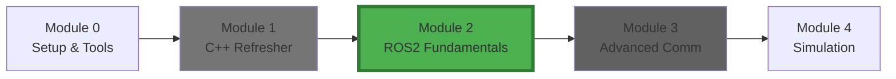
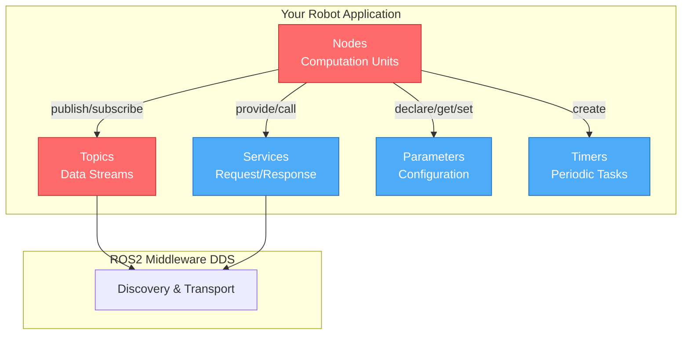
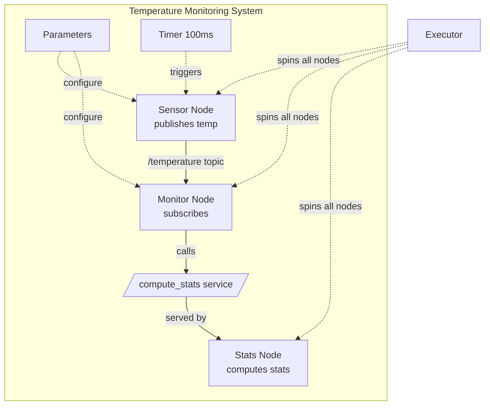
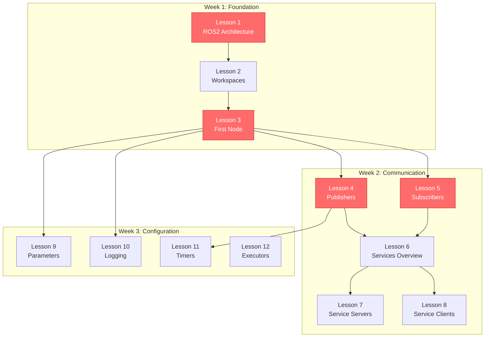
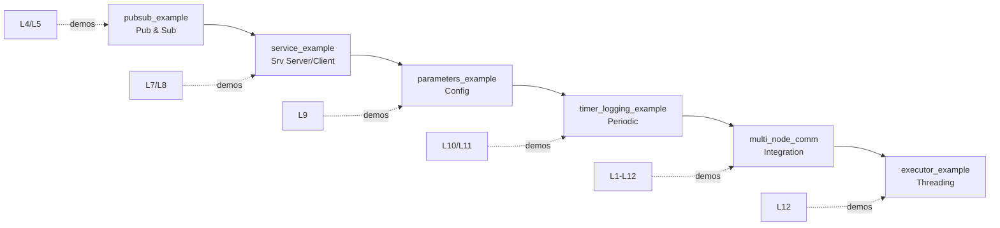
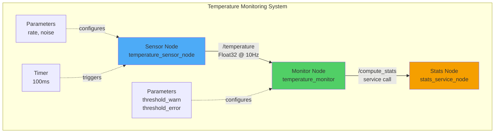
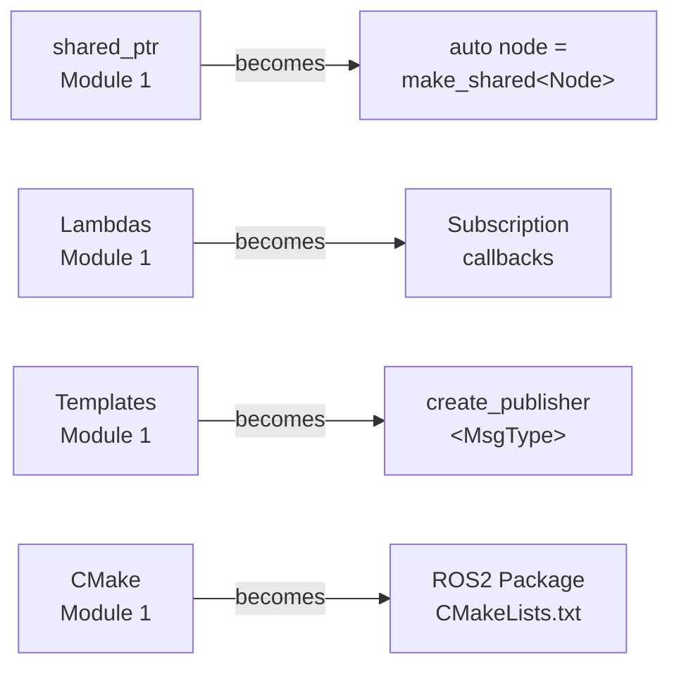
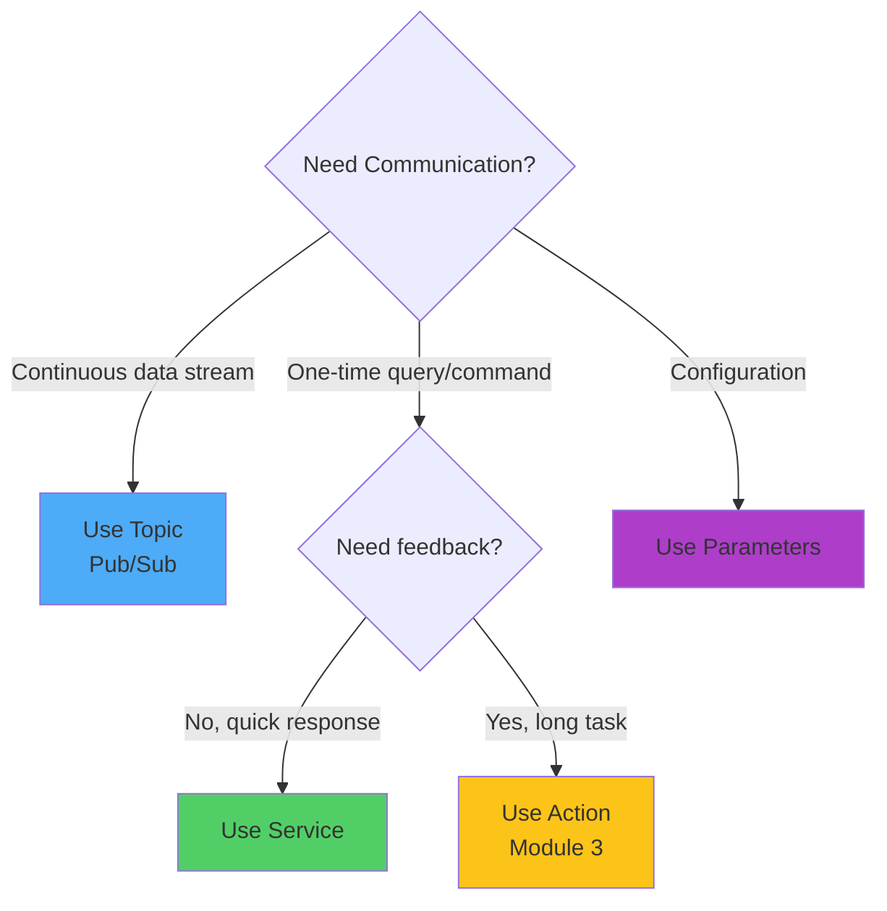

# Module 2: ROS2 Fundamentals

## Module Overview

This module teaches the **core concepts of ROS2**: nodes, topics, services, parameters, and basic communication patterns. You'll learn the building blocks that every ROS2 application uses, from sensor interfaces to robot controllers.

By the end, you'll be able to build functional, production-ready ROS2 applications in C++.

## Module Position in Learning Journey



*You are here → Core ROS2 concepts and communication patterns*

## What You'll Learn (Conceptual Overview)

### ROS2 Communication Architecture



**Legend:**
- 🔴 **Critical** - Core to every ROS2 application
- 🔵 **Important** - Frequently used patterns
- 🟢 **Foundational** - Supporting concepts

### Conceptual Breakdown

#### Nodes
**What it is:**
An independent process that performs computation in a ROS2 system. A node is a C++ class inheriting from `rclcpp::Node`, managed with `shared_ptr`.

**What it does/needed for:**
- Represents a single, well-defined purpose (sensor driver, controller, monitor)
- Communicates with other nodes via topics, services, actions
- Configured via parameters
- Managed by executors for spinning/processing callbacks

**Why it matters:**
Nodes are the fundamental building blocks of ROS2 systems. Every robot application is a collection of nodes working together. Understanding node lifecycle and structure is essential for any ROS2 development. Without nodes, you have no way to organize or distribute robot functionality.

**How it connects:**
- Builds on: C++ classes (Module 1), smart pointers (Module 1)
- Contains: Publishers, subscribers, services, timers, parameters
- Managed by: Executors
- Prepares for: Multi-node systems, distributed robotics (Module 3+)

**Example Use Case:**
```cpp
class CameraNode : public rclcpp::Node {
public:
    CameraNode() : Node("camera_node") {
        publisher_ = create_publisher<sensor_msgs::msg::Image>("image", 10);
        timer_ = create_wall_timer(33ms, [this]() { capture_and_publish(); });
    }
private:
    rclcpp::Publisher<sensor_msgs::msg::Image>::SharedPtr publisher_;
    rclcpp::TimerBase::SharedPtr timer_;
};
```

#### Topics (Publish/Subscribe)
**What it is:**
Named channels for asynchronous, many-to-many message passing. Publishers send messages to topics; subscribers receive them through callbacks.

**What it does/needed for:**
- **Decouples** producers from consumers (publishers don't know who's listening)
- **Asynchronous**: Publishers send without waiting for acknowledgment
- **Many-to-many**: Multiple publishers and subscribers on same topic
- **Typed**: Each topic has a specific message type for safety

**Why it matters:**
Topics are how sensor data flows through your robot - camera images, lidar scans, IMU data, velocity commands all use topics. This is the **primary communication pattern** in ROS2 (90% of communication). Master topics, and you can build most robot applications.

**How it connects:**
- Builds on: Templates (Module 1), DDS architecture (Lesson 1)
- Used by: Every sensor and actuator interface
- Related to: Message types, QoS policies
- Prepares for: Sensor fusion, command pipelines (Module 4+)

**Example Use Case:**
```cpp
// Publisher (sensor node)
auto publisher = create_publisher<std_msgs::msg::Float32>("temperature", 10);
auto msg = std::make_unique<std_msgs::msg::Float32>();
msg->data = read_sensor();
publisher->publish(std::move(msg));

// Subscriber (monitor node)
auto subscription = create_subscription<std_msgs::msg::Float32>(
    "temperature", 10,
    [](const std_msgs::msg::Float32::SharedPtr msg) {
        std::cout << "Temp: " << msg->data << std::endl;
    }
);
```

#### Services (Request/Response)
**What it is:**
Synchronous, one-to-one communication pattern. Client sends request, blocks until server responds with result.

**What it does/needed for:**
- **Synchronous**: Client waits for response (blocking or async)
- **One-to-one**: Single client talks to single server
- **Typed**: Request and response have specific types
- **Use for**: Configuration changes, one-time queries, triggering actions

**Why it matters:**
When you need a response (not just fire-and-forget like topics), use services. Examples: "What's the robot's current pose?" "Enable the motor" "Compute path to goal". Essential for robot control and configuration.

**How it connects:**
- Builds on: Nodes, callbacks (lambdas from Module 1)
- Complements: Topics (different pattern for different needs)
- Related to: Actions (long-running services, Module 3)
- Prepares for: Configuration systems, planning services

**Example Use Case:**
```cpp
// Service server
auto service = create_service<std_srvs::srv::SetBool>(
    "enable_motor",
    [](auto request, auto response) {
        motor_enabled = request->data;
        response->success = true;
        response->message = motor_enabled ? "Enabled" : "Disabled";
    }
);

// Service client
auto client = create_client<std_srvs::srv::SetBool>("enable_motor");
auto request = std::make_shared<std_srvs::srv::SetBool::Request>();
request->data = true;
auto future = client->async_send_request(request);
```

#### Parameters
**What it is:**
Node configuration values (typed: int, double, string, bool, arrays) that can be set at runtime without recompiling.

**What it does/needed for:**
- Configure node behavior (PID gains, topic names, thresholds, update rates)
- Change values via command line, YAML files, or other nodes
- Dynamic reconfiguration with callbacks
- Validation and constraints

**Why it matters:**
Parameters let you tune robot behavior without rebuilding code. Change PID gains, adjust sensor thresholds, configure topic names - all at runtime. Critical for testing, tuning, and deploying robots in different environments.

**How it connects:**
- Builds on: Node creation (Lesson 3)
- Used by: All configurable nodes
- Related to: Launch files (Module 3)
- Prepares for: Dynamic reconfiguration, fleet management

#### Timers
**What it is:**
Periodic callback execution at specified intervals, using wall clock or ROS time.

**What it does/needed for:**
- Regular tasks: sensor polling, control loops, status publishing
- Time-driven behavior (vs event-driven subscriptions)
- High-frequency or low-frequency periodic operations

**Why it matters:**
Control loops, sensor polling, heartbeats, watchdogs - all use timers. They're how you implement time-based behavior in robots.

**How it connects:**
- Builds on: Lambdas (Module 1), publishers (Lesson 4)
- Used in: Control nodes, sensor simulators, monitoring
- Related to: Executors (callback processing)

#### Executors
**What it is:**
Threading model that spins nodes and processes callbacks (single-threaded or multi-threaded).

**What it does/needed for:**
- Manage when and how callbacks execute
- Control concurrency and callback ordering
- Enable real-time behavior
- Prevent callback blocking

**Why it matters:**
Understanding executors lets you control callback execution, prevent blocking, and optimize performance. Critical for real-time systems and complex multi-callback nodes.

**How it connects:**
- Builds on: All callback concepts (subscriptions, timers, services)
- Manages: All node callbacks
- Prepares for: Real-time systems (Module 6), advanced concurrency

### How Concepts Work Together



**Real Example:** Temperature monitoring system (our mini-project)
- **Sensor node**: Timer triggers temp reading, publishes to /temperature topic
- **Monitor node**: Subscribes to /temperature, logs warnings if threshold exceeded
- **Stats node**: Provides /compute_stats service to compute min/max/avg
- **Parameters**: Configure thresholds, update rates, topic names
- **Executor**: Spins all nodes, processes callbacks

## Learning Objectives

By the end of this module, you will:
- ✓ Understand ROS2 architecture (DDS, computational graph, QoS)
- ✓ Create nodes inheriting from rclcpp::Node
- ✓ Publish and subscribe to topics with proper QoS
- ✓ Create and call services (servers and clients)
- ✓ Declare and use parameters with validation
- ✓ Use timers for periodic tasks
- ✓ Understand executors and spinning
- ✓ Build complete ROS2 packages with CMake
- ✓ Use professional logging (RCLCPP_INFO, etc.)
- ✓ Debug ROS2 systems with command-line tools

## Prerequisites

### From Previous Modules
- **Module 0**: ROS2 Humble installed, workspace basics, build tools
- **Module 1**: Smart pointers, lambdas, templates, CMake fundamentals

### Technical Requirements
- Ubuntu 22.04 (or WSL2/Docker)
- ROS2 Humble Hawksbill
- C++ compiler with C++17 support
- colcon build tools

## Module Structure

### Lessons Overview



### Detailed Lesson List

#### Week 1: Foundation (Lessons 1-3)

**1. [ROS2 Architecture](lessons/01-ros2-architecture.md)** ⏱️ 45 min | 🔴 Critical
- **What:** DDS middleware, computational graph, nodes, topics, services, actions, QoS
- **Why:** Understanding architecture informs all design decisions
- **Key Topics:** ROS1 vs ROS2, DDS communication, graph concepts, lifecycle
- **Builds on:** Module 0 (installation), general programming
- **Prepares for:** All subsequent lessons

**2. [Creating Workspaces](lessons/02-creating-workspace.md)** ⏱️ 30 min
- **What:** ROS2 workspace overlays, colcon build, package structure
- **Why:** Organize and build ROS2 packages properly
- **Key Topics:** src/build/install structure, overlays, sourcing
- **Builds on:** Module 0 workspace basics, Module 1 CMake
- **Prepares for:** Creating packages (Lesson 3+)

**3. [First Node](lessons/03-first-node.md)** ⏱️ 60 min | 🔴 Critical
- **What:** Creating a minimal C++ node inheriting from rclcpp::Node
- **Why:** Nodes are the foundation of all ROS2 applications
- **Key Topics:** rclcpp::Node, constructors, main(), rclcpp::spin()
- **Builds on:** Module 1 OOP, smart pointers
- **Prepares for:** Publishers, subscribers, services

#### Week 2: Communication (Lessons 4-8)

**4. [Topics: Publishers](lessons/04-topics-publishers.md)** ⏱️ 60 min | 🔴 Critical
- **What:** Creating publishers, publishing messages to topics
- **Why:** Output data from your nodes (sensor readings, commands)
- **Key Topics:** create_publisher<T>, publish(), message types, QoS
- **Builds on:** First node (L3), templates (M1), move semantics (M1)
- **Prepares for:** Sensor nodes, command publishers

**5. [Topics: Subscribers](lessons/05-topics-subscribers.md)** ⏱️ 60 min | 🔴 Critical
- **What:** Creating subscribers, receiving messages via callbacks
- **Why:** Receive data in your nodes (sensor input, commands)
- **Key Topics:** create_subscription<T>, callback lambdas, message handling
- **Builds on:** First node (L3), lambdas (M1)
- **Prepares for:** Processing pipelines, sensor fusion

**6. [Services: Overview](lessons/06-services-overview.md)** ⏱️ 30 min
- **What:** Request/response pattern, when to use vs topics
- **Why:** Synchronous communication for queries and commands
- **Key Topics:** Service types, client/server pattern, async calls
- **Builds on:** Topics (L4-L5), ROS2 architecture (L1)
- **Prepares for:** Service servers/clients (L7-L8)

**7. [Service Servers](lessons/07-service-servers.md)** ⏱️ 45 min
- **What:** Implementing service servers (provide capabilities)
- **Why:** Expose node functionality to other nodes
- **Key Topics:** create_service<T>, request/response handling
- **Builds on:** Services overview (L6), callbacks
- **Prepares for:** Configuration services, compute services

**8. [Service Clients](lessons/08-service-clients.md)** ⏱️ 45 min
- **What:** Calling services from nodes
- **Why:** Request capabilities from other nodes
- **Key Topics:** create_client<T>, async_send_request(), futures
- **Builds on:** Service servers (L7)
- **Prepares for:** Orchestration nodes, system integration

#### Week 3: Configuration & Execution (Lessons 9-12)

**9. [Parameters](lessons/09-parameters.md)** ⏱️ 45 min | 🔵 Important
- **What:** Declare, get, set runtime configuration
- **Why:** Tune behavior without recompiling
- **Key Topics:** declare_parameter(), get_parameter(), callbacks, YAML files
- **Builds on:** First node (L3)
- **Prepares for:** Configurable systems, launch files (Module 3)

**10. [Logging](lessons/10-logging.md)** ⏱️ 30 min
- **What:** RCLCPP_INFO/WARN/ERROR logging system
- **Why:** Debug and monitor node behavior
- **Key Topics:** Log levels, formatted output, throttling, conditional logging
- **Builds on:** First node (L3)
- **Prepares for:** Debugging complex systems

**11. [Timers](lessons/11-timers.md)** ⏱️ 45 min | 🔵 Important
- **What:** Periodic callback execution with create_wall_timer()
- **Why:** Time-driven tasks (control loops, status publishing)
- **Key Topics:** Timers, chrono literals, periodic callbacks
- **Builds on:** Lambdas (M1), publishers (L4)
- **Prepares for:** Control nodes, periodic publishing

**12. [Executors](lessons/12-executors.md)** ⏱️ 45 min
- **What:** Threading models for callback processing
- **Why:** Control concurrency and callback execution
- **Key Topics:** SingleThreaded, MultiThreaded, spin(), callback groups
- **Builds on:** All callback concepts
- **Prepares for:** Advanced concurrency (Module 6), real-time systems

### Code Examples



| Example Package | Demonstrates | Related Lessons | Complexity |
|----------------|--------------|-----------------|------------|
| `pubsub_example/` | Publishers, subscribers, timers | L4, L5, L11 | ⭐ Beginner |
| `service_example/` | Service servers and clients | L7, L8 | ⭐⭐ Intermediate |
| `parameters_example/` | Parameters, validation, YAML | L9 | ⭐⭐ Intermediate |
| `timer_logging_example/` | Timers, logging levels, throttling | L10, L11 | ⭐⭐ Intermediate |
| `multi_node_communication/` | Complete multi-node system | All | ⭐⭐⭐ Advanced |
| `executor_example/` | Multi-threading, callback groups | L12 | ⭐⭐⭐ Advanced |

### Exercises

| # | Name | Skills Practiced | Related Lessons | Estimated Time |
|---|------|------------------|-----------------|----------------|
| 1 | Create First Node | Node class, main, spinning | L3 | 1 hour |
| 2 | Number Publisher/Subscriber | Pub/sub pattern, callbacks | L4, L5 | 2 hours |
| 3 | Echo Service | Service server/client, futures | L7, L8 | 2 hours |
| 4 | Configurable Node | Parameters, dynamic config | L9 | 2 hours |

### Mini-Project: Temperature Monitor System

**Objective:** Build a complete multi-node temperature monitoring system

**System Architecture:**


**Nodes to Build:**

1. **Sensor Node** (`temperature_sensor_node`)
   - Publishes temperature readings to `/temperature` topic
   - Uses timer for periodic publishing (configurable rate)
   - Simulates sensor with noise (parameter-based)
   - Logs readings at DEBUG level

2. **Monitor Node** (`temperature_monitor`)
   - Subscribes to `/temperature` topic
   - Logs warnings if temperature > threshold
   - Logs errors if temperature > critical threshold
   - Thresholds configurable via parameters

3. **Stats Node** (`stats_service_node`)
   - Provides `/compute_stats` service
   - Computes min/max/average from stored readings
   - Returns statistics on service call

**Skills Demonstrated:**
- Node creation (3 nodes)
- Publishers and subscribers (topic communication)
- Services (server and client)
- Parameters (thresholds, rates, configuration)
- Timers (sensor polling)
- Logging (warnings, info, debug levels)
- Multi-node system integration

**Deliverables:**
- 3 working nodes in a single package
- CMakeLists.txt and package.xml
- config/params.yaml for configuration
- README with build/run instructions

**Estimated Time:** 4-6 hours

## Connection to Previous Modules

### From Module 0 (Getting Started):
- **Workspace structure** you learned in Module 0
- **Build tools** (colcon) you installed
- **ros2 CLI commands** for introspection
- **Environment setup** (sourcing workspaces)

### From Module 1 (C++ Refresher):
- **Smart pointers** for node management (`shared_ptr<Node>`)
- **Lambdas** for callbacks (subscriptions, timers, services)
- **Templates** in `create_publisher<T>` and `create_subscription<T>`
- **Move semantics** for efficient message passing (`std::move(msg)`)
- **CMake** for building ROS2 packages

### How C++ Connects to ROS2:



## Connection to Next Modules

### Module 3 (ROS2 Intermediate) will:
- Add **actions** for long-running tasks with feedback
- Introduce **launch files** to start multiple nodes
- Use **TF2** for coordinate transformations
- Create **custom message types**
- Implement **lifecycle nodes**

### Module 4 (Simulation) will:
- Use nodes to interface with **Gazebo**
- Publish sensor data (**cameras, lidar, IMU**)
- Subscribe to control commands
- Integrate with simulation clock

### Module 5-6 (Hardware & Advanced) will:
- Interface with real hardware (sensors, actuators)
- Implement real-time control loops
- Use advanced executors for performance
- Deploy to production robots

## Conceptual Bridges

### Bridge from Module 1 (C++ → ROS2)

You've learned modern C++ (Module 1), now see it in action in ROS2:

| C++ Concept | ROS2 Application |
|-------------|------------------|
| `shared_ptr<T>` | Node lifecycle management |
| Lambdas `[this]() {}` | Subscription/timer callbacks |
| Templates `<typename T>` | Type-safe publishers/subscribers |
| `std::move()` | Zero-copy message publishing |
| CMake | Building ROS2 packages |

**Example:** Creating a publisher combines all of these:
```cpp
// Smart pointer for node
auto node = std::make_shared<rclcpp::Node>("my_node");

// Template for type safety
auto publisher = node->create_publisher<std_msgs::msg::String>("topic", 10);

// Lambda for timer callback
auto timer = node->create_wall_timer(1s, [&]() {
    auto msg = std::make_unique<std_msgs::msg::String>();
    msg->data = "Hello";
    publisher->publish(std::move(msg));  // Move semantics
});
```

### Bridge to Module 3 (Fundamentals → Advanced Communication)

This module teaches **point-to-point** communication (node-to-node). Module 3 will add:
- **Actions**: Topics + Services combined for long tasks
- **Launch files**: Start entire systems
- **TF2**: Coordinate frame transformations
- **Custom messages**: Domain-specific data types

### Communication Patterns Decision Tree



## Critical Concepts to Master

### 1. Nodes
**Why critical:** Everything in ROS2 is a node. You cannot build anything without understanding nodes.

**Verification:**
- [ ] Can you create a node class inheriting from rclcpp::Node?
- [ ] Can you instantiate it with make_shared and spin it?
- [ ] Do you understand the node lifecycle?

### 2. Publishers/Subscribers (Topics)
**Why critical:** 90% of ROS2 communication uses topics. This is how data flows in your robot.

**Verification:**
- [ ] Can you create a publisher and publish messages?
- [ ] Can you create a subscriber with lambda callbacks?
- [ ] Do you understand QoS settings?

### 3. Services
**Why critical:** Request/response communication for commands and queries.

**Verification:**
- [ ] Can you implement a service server?
- [ ] Can you call a service from a client?
- [ ] Do you know when to use services vs topics?

### 4. Workspaces & Build System
**Why critical:** How you organize and build all ROS2 code.

**Verification:**
- [ ] Can you create a package with ros2 pkg create?
- [ ] Can you write CMakeLists.txt for ROS2?
- [ ] Can you build with colcon and source the workspace?

## Common Questions

**Q: When should I use topics vs services?**
A: Use **topics** for continuous data streams (sensor data, commands that can be sent repeatedly). Use **services** for one-time requests that need a response (get pose, trigger action, change mode). If you need feedback on a long-running task, use actions (Module 3).

**Q: Why do publishers/subscribers use shared_ptr?**
A: They need **shared ownership** between your node and the ROS2 executor/middleware. `shared_ptr` ensures they stay alive as long as needed and are properly cleaned up when no longer used.

**Q: What's the difference between spin() and spin_some()?**
A: `spin()` **blocks forever** processing callbacks until shutdown. `spin_some()` processes **available callbacks once** and returns (useful for custom loops where you need to do other work).

**Q: How do I choose QoS settings?**
A: Start with **defaults** (reliable, volatile). Use `SensorDataQoS` for lossy sensor data (lidar, cameras). Use reliable QoS for commands and critical data. Module 3 covers QoS in depth.

**Q: Can one node have multiple publishers/subscribers?**
A: **Yes!** Nodes often have many publishers and subscribers. Create as many as needed for your application.

**Q: What's the difference between wall timer and ROS timer?**
A: **Wall timer** uses real-world time (always progresses). **ROS timer** respects simulation time (can be paused/accelerated). For most cases, use wall timer.

## Module Checklist

Before moving to Module 3, ensure you can:

### Conceptual Understanding
- [ ] Explain ROS2 architecture (DDS, graph, QoS)
- [ ] Describe when to use topics vs services vs parameters
- [ ] Understand node lifecycle and spinning
- [ ] Explain QoS policies and their effects

### Practical Skills
- [ ] Create a node class inheriting from rclcpp::Node
- [ ] Create publishers and publish messages
- [ ] Create subscribers with lambda callbacks
- [ ] Implement service servers and clients
- [ ] Use parameters for configuration
- [ ] Use timers for periodic tasks
- [ ] Use logging (DEBUG, INFO, WARN, ERROR)

### Build & Run
- [ ] Create a ROS2 package with ros2 pkg create
- [ ] Write CMakeLists.txt and package.xml
- [ ] Build with colcon
- [ ] Source workspace and run nodes
- [ ] Use ros2 CLI tools (topic, service, param, node)

### Projects
- [ ] Completed all 6 example packages
- [ ] Completed all 4 exercises
- [ ] Built mini-project (temperature monitor)
- [ ] Debugged multi-node systems

## Verification Questions

Test your understanding before moving to Module 3:

### 1. Nodes & Architecture
**Q:** What's the purpose of a node? What does `rclcpp::spin()` do?

**Q:** Why does ROS2 use DDS instead of a custom protocol like ROS1?

**Q:** Create a node with a publisher and subscriber in the same class.

### 2. Communication Patterns
**Q:** What's the difference between topics and services?

**Q:** When would you use a service instead of a topic?

**Q:** Why can topics have multiple publishers and subscribers, but services are one-to-one?

### 3. Practical Integration
**Challenge:** Build a 2-node system where:
- Node 1 publishes sensor data (Float64) on /sensor topic
- Node 2 subscribes, logs the data, and provides a /get_stats service
- Both nodes configurable via parameters

## What's Next?

### You've Learned ✓
- Core ROS2 communication patterns (topics, services)
- Node lifecycle and management
- Configuration with parameters
- Building ROS2 packages with CMake and colcon
- Professional logging and debugging
- Multi-node system integration

### Next Steps

**→ Proceed to [Module 3: ROS2 Intermediate](../03-ros2-intermediate/)**

Module 3 will teach you:
- **Actions** for long-running tasks with feedback and cancellation
- **Launch files** to start entire multi-node systems
- **TF2** for coordinate transformations (critical for robots!)
- **Custom message types** for domain-specific data
- **Lifecycle nodes** for managed node states

**→ Or Practice More:**
- Build additional pub/sub systems
- Experiment with QoS settings (reliable vs best-effort)
- Create multi-node applications
- Integrate timers, parameters, and services together

---

## Estimated Time

- **Lessons (12)**: 8-10 hours (2 weeks at moderate pace)
- **Code Examples (6)**: 3-4 hours
- **Exercises (4)**: 5-8 hours
- **Mini-project**: 4-6 hours
- **Total**: 20-28 hours (3-4 weeks)

**Fast Track:** Focus on lessons 1, 3, 4, 5, 7, 8 (critical path) - 2 weeks
**Comprehensive:** Complete all lessons, examples, exercises - 4 weeks

---

**Ready to begin?** Start with **[Lesson 1: ROS2 Architecture](lessons/01-ros2-architecture.md)**!
