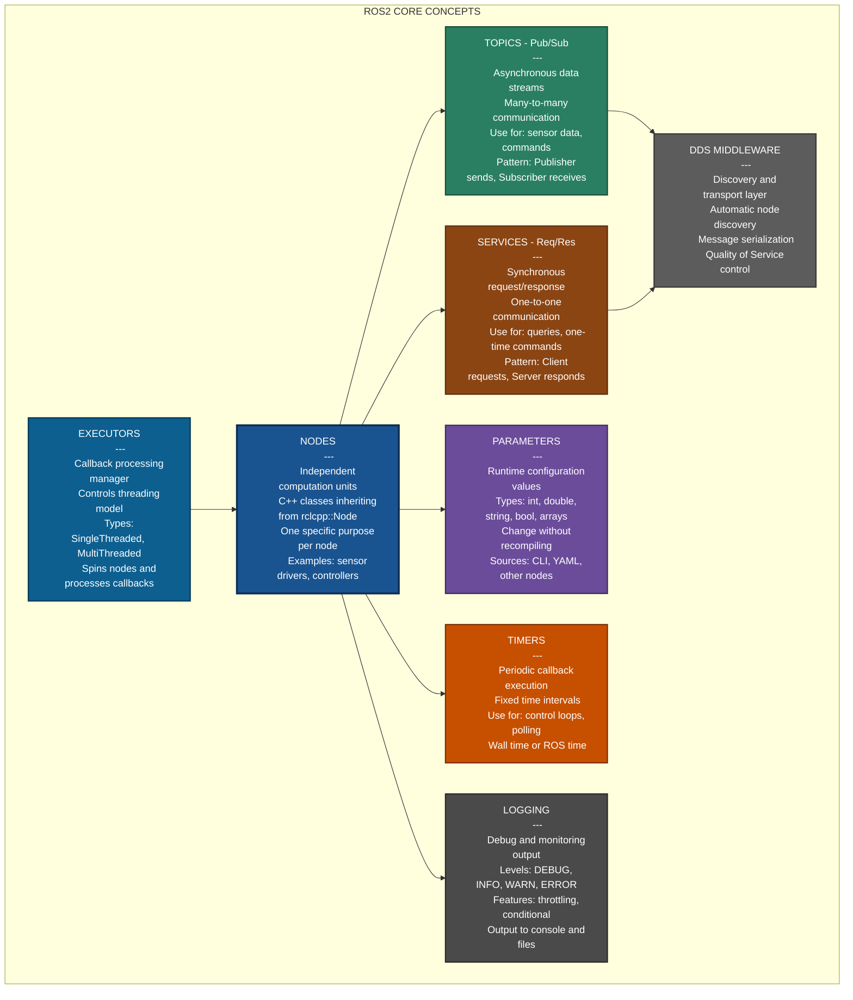
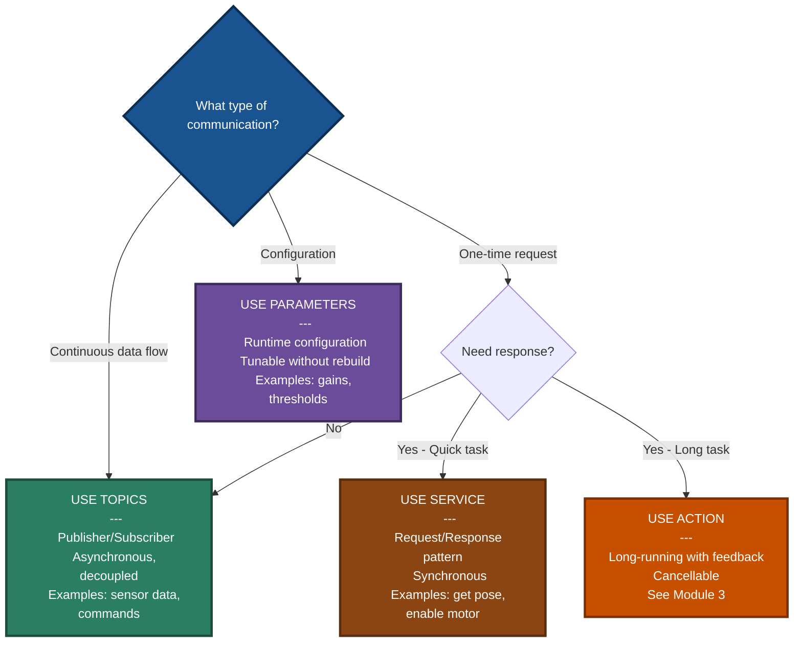
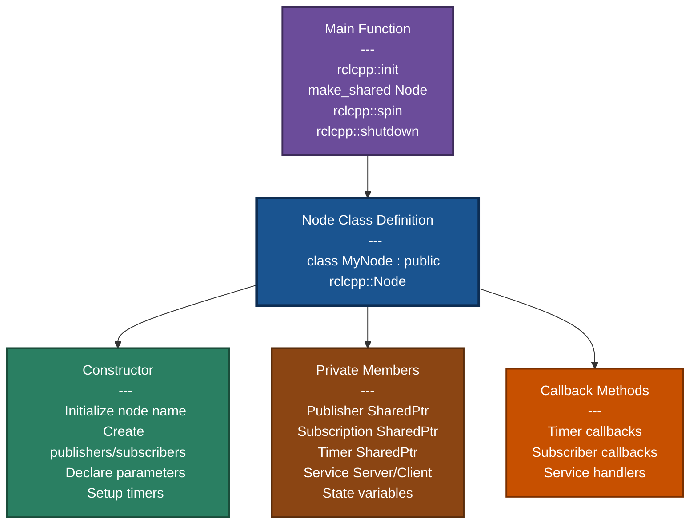
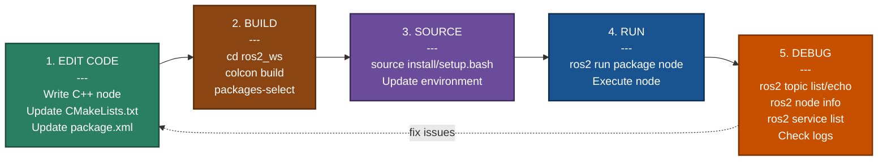
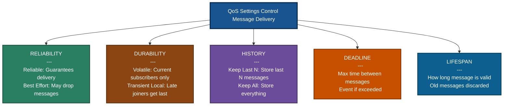

# Module 2: ROS2 Fundamentals - Visual Summary

This document provides a comprehensive visual guide to all core ROS2 concepts covered in Module 2.

## Complete ROS2 Architecture Overview



## Communication Patterns Decision Tree



## Publisher and Subscriber Flow

```mermaid
graph LR
    subgraph PUB["PUBLISHER SIDE"]
        P1["Create Publisher
        create_publisher MsgType"]
        P2["Create Message
        make_unique MsgType"]
        P3["Fill Data
        msg->data = value"]
        P4["Publish
        publish std::move msg"]
    end

    subgraph TOPIC_LAYER["TOPIC via DDS"]
        TOPIC_NAME["/topic_name"]
    end

    subgraph SUB["SUBSCRIBER SIDE"]
        S1["Create Subscription
        create_subscription MsgType"]
        S2["Define Callback
        Lambda or std::bind"]
        S3["Process Message
        Handle incoming data"]
    end

    P1 --> P2 --> P3 --> P4
    P4 --> TOPIC_NAME
    TOPIC_NAME --> S1
    S1 --> S2 --> S3

    style P1 fill:#2a7f62,stroke:#1a4d3a,stroke-width:2px,color:#fff
    style P2 fill:#2a7f62,stroke:#1a4d3a,stroke-width:2px,color:#fff
    style P3 fill:#2a7f62,stroke:#1a4d3a,stroke-width:2px,color:#fff
    style P4 fill:#2a7f62,stroke:#1a4d3a,stroke-width:2px,color:#fff
    style TOPIC_NAME fill:#1a5490,stroke:#0d2d52,stroke-width:2px,color:#fff
    style S1 fill:#2a7f62,stroke:#1a4d3a,stroke-width:2px,color:#fff
    style S2 fill:#2a7f62,stroke:#1a4d3a,stroke-width:2px,color:#fff
    style S3 fill:#2a7f62,stroke:#1a4d3a,stroke-width:2px,color:#fff
```



## Service Client and Server Flow

```mermaid
graph LR
    subgraph CLIENT["SERVICE CLIENT"]
        C1["Create Client
        create_client SrvType"]
        C2["Create Request
        make_shared Request"]
        C3["Send Request
        async_send_request"]
        C4["Wait for Response
        future.get"]
    end

    subgraph SRV_LAYER["SERVICE via DDS"]
        SRV_NAME["/service_name"]
    end

    subgraph SERVER["SERVICE SERVER"]
        S1["Create Service
        create_service SrvType"]
        S2["Define Handler
        Lambda callback"]
        S3["Process Request
        Read request data"]
        S4["Send Response
        Fill response data"]
    end

    C1 --> C2 --> C3 --> C4
    C3 --> SRV_NAME
    SRV_NAME --> S1
    S1 --> S2 --> S3 --> S4
    S4 -.response.-> C4

    style C1 fill:#8b4513,stroke:#5a2d0c,stroke-width:2px,color:#fff
    style C2 fill:#8b4513,stroke:#5a2d0c,stroke-width:2px,color:#fff
    style C3 fill:#8b4513,stroke:#5a2d0c,stroke-width:2px,color:#fff
    style C4 fill:#8b4513,stroke:#5a2d0c,stroke-width:2px,color:#fff
    style SRV_NAME fill:#1a5490,stroke:#0d2d52,stroke-width:2px,color:#fff
    style S1 fill:#8b4513,stroke:#5a2d0c,stroke-width:2px,color:#fff
    style S2 fill:#8b4513,stroke:#5a2d0c,stroke-width:2px,color:#fff
    style S3 fill:#8b4513,stroke:#5a2d0c,stroke-width:2px,color:#fff
    style S4 fill:#8b4513,stroke:#5a2d0c,stroke-width:2px,color:#fff
```



## Typical Node Structure



## Development Workflow



## QoS (Quality of Service) Policies



---

## Quick Reference Tables

### When to Use Each Pattern

| Pattern | Use Case | Example |
|---------|----------|---------|
| **Topics (Pub/Sub)** | Continuous data streams, many-to-many | Sensor data (camera, lidar), robot velocity commands, status updates |
| **Services (Req/Res)** | One-time requests needing response | Get current pose, enable/disable motor, compute path |
| **Parameters** | Runtime configuration | PID gains, sensor thresholds, topic names, update rates |
| **Timers** | Periodic execution | Control loops, sensor polling, heartbeats, watchdogs |
| **Actions** | Long-running tasks with feedback | Navigation goals, manipulation tasks (covered in Module 3) |

### Essential Code Patterns

#### Publisher Pattern
```cpp
// 1. Declare member
Publisher<MsgType>::SharedPtr publisher_;

// 2. Create in constructor
publisher_ = create_publisher<MsgType>("topic_name", 10);

// 3. Publish message
auto msg = make_unique<MsgType>();
msg->data = value;
publisher_->publish(std::move(msg));
```

#### Subscriber Pattern
```cpp
// 1. Declare member
Subscription<MsgType>::SharedPtr subscription_;

// 2. Create with lambda
subscription_ = create_subscription<MsgType>(
    "topic_name", 10,
    [this](const MsgType::SharedPtr msg) {
        // Process message
        RCLCPP_INFO(get_logger(), "Received: %s", msg->data.c_str());
    });
```

#### Service Server Pattern
```cpp
// Create service
service_ = create_service<SrvType>(
    "service_name",
    [this](const Request::SharedPtr request,
           Response::SharedPtr response) {
        // Process request, fill response
        response->result = process(request->data);
    });
```

#### Service Client Pattern
```cpp
// 1. Create client
auto client = create_client<SrvType>("service_name");

// 2. Create request
auto request = make_shared<SrvType::Request>();
request->data = value;

// 3. Send and wait
auto future = client->async_send_request(request);
auto response = future.get();
```

#### Timer Pattern
```cpp
// Create timer with lambda callback
timer_ = create_wall_timer(
    std::chrono::seconds(1),
    [this]() {
        // Periodic task
        RCLCPP_INFO(get_logger(), "Timer callback");
    });
```

#### Parameter Pattern
```cpp
// 1. Declare with default
declare_parameter("param_name", default_value);

// 2. Get value
auto value = get_parameter("param_name").as_double();
// or .as_int(), .as_string(), .as_bool()
```

---

## Critical Concepts Summary

### Core Principles

1. **Nodes** are independent processes - one specific purpose per node
2. **Topics** are asynchronous and decoupled - publishers don't know subscribers
3. **Services** are synchronous - client waits for server response
4. **Smart pointers** manage all ROS2 objects (shared_ptr, unique_ptr)
5. **Lambda callbacks** are the modern C++ way to handle events
6. **QoS settings** control reliability, durability, and delivery guarantees
7. **Executors** control threading model and callback execution
8. **DDS middleware** handles discovery and transport automatically

### Best Practices

**DO:**
- ✓ Use `std::make_shared` for nodes
- ✓ Use `std::make_unique` for messages (enables zero-copy with `std::move`)
- ✓ Prefer lambdas `[this]() {...}` for callbacks
- ✓ Always source workspace after building: `source install/setup.bash`
- ✓ Use RCLCPP_INFO/WARN/ERROR for logging
- ✓ Declare parameters with sensible defaults
- ✓ Choose appropriate QoS for your use case
- ✓ One clear purpose per node

**DON'T:**
- ✗ Don't use raw pointers or manual `new`/`delete`
- ✗ Don't block in callbacks (use MultiThreadedExecutor if needed)
- ✗ Don't put multiple unrelated functions in one node
- ✗ Don't forget to source workspace before running
- ✗ Don't ignore QoS - defaults aren't always right

### Common QoS Profiles

| Profile | Reliability | Durability | Use Case |
|---------|-------------|------------|----------|
| **Default** | Reliable | Volatile | Commands, critical data |
| **Sensor Data** | Best Effort | Volatile | High-frequency sensor streams |
| **Parameters** | Reliable | Transient Local | Configuration that late joiners need |
| **System Default** | Reliable | Volatile | General purpose |

---

**This visual summary provides a complete overview of Module 2: ROS2 Fundamentals**

Use these diagrams as quick reference while developing ROS2 applications!
