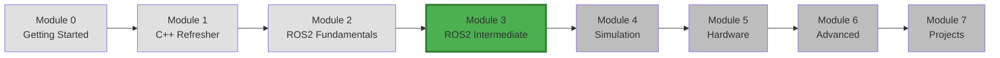
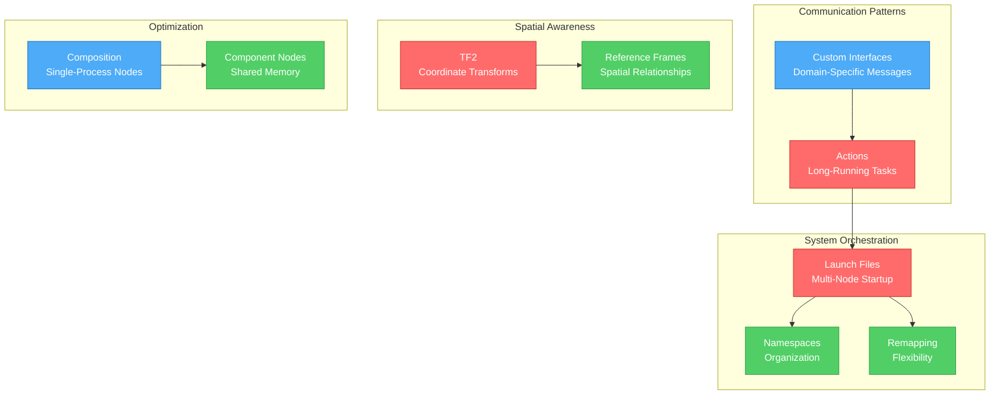
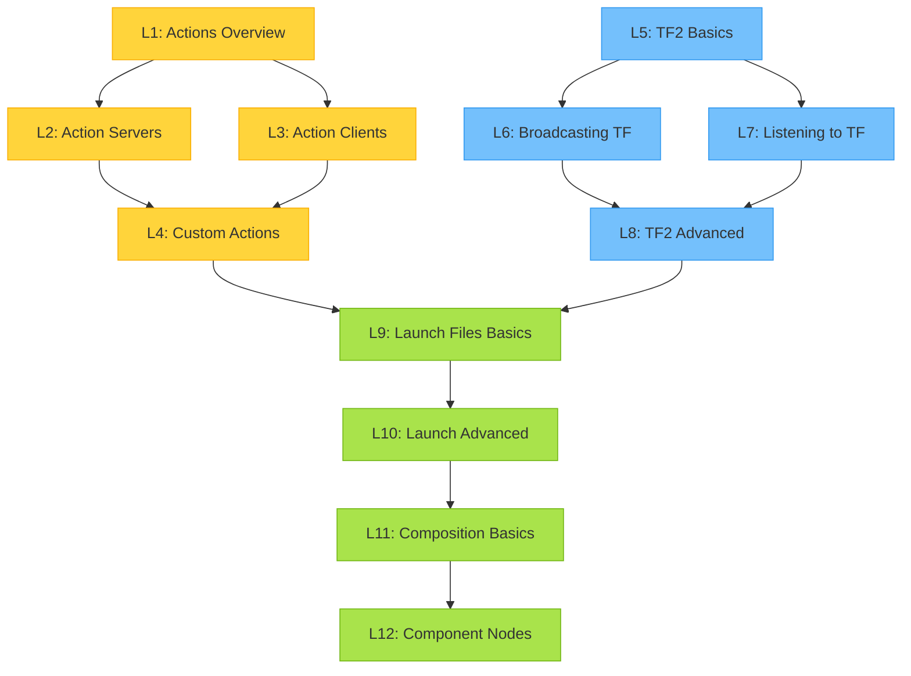
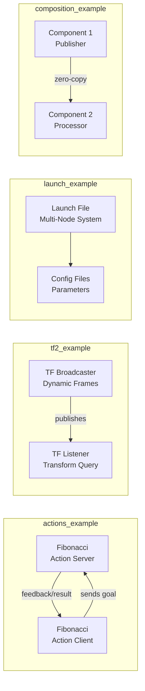
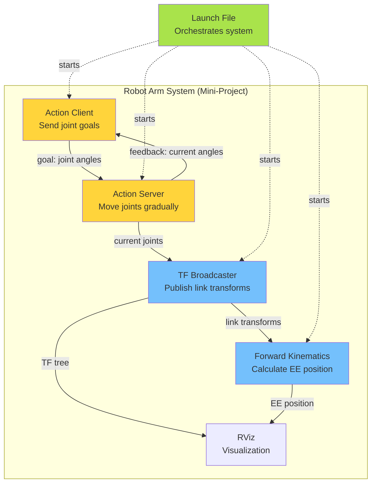

# Module 3: ROS2 Intermediate

## Module Overview

This module advances your ROS2 knowledge beyond the fundamentals, introducing powerful patterns for building complex, production-ready robotic systems. You'll learn to handle long-running tasks with actions, manage coordinate transformations with TF2, orchestrate multi-node systems with launch files, and optimize performance with composition.

**Duration**: 2-3 weeks
**Prerequisites**: Module 2 (ROS2 Fundamentals)

## Module Position in Learning Journey

## What You'll Learn (Conceptual Overview)

### Core Concepts Map

### Conceptual Breakdown

#### Actions (Long-Running Tasks)

**What it is:**
A communication pattern for tasks that take time to complete (seconds to minutes), providing feedback during execution and allowing cancellation.

**What it does/needed for:**
- Execute long-running operations (navigation, grasping, processing)
- Provide progress feedback to clients
- Support task cancellation mid-execution
- Enable asynchronous request-response with status updates

**Why it matters:**
Unlike services (which block until complete), actions allow clients to monitor progress and cancel if needed. Critical for robotics where tasks like "move to position" or "process image" take time. Without actions, you'd have no way to know if a 30-second task is progressing or stuck.

**How it connects:**
- **Builds on**: Topics (feedback), Services (goal/result)
- **Used by**: Navigation stacks, manipulation planners, perception pipelines
- **Related to**: State machines, behavior trees
- **Prepares for**: Complex robot behaviors, autonomous missions

#### TF2 (Coordinate Transformations)

**What it is:**
A framework for tracking and transforming between multiple coordinate frames (e.g., robot base, camera, wheels, world) over time.

**What it does/needed for:**
- Transform sensor data from camera frame to robot frame
- Track relationships between moving parts (rotating joint → gripper position)
- Answer questions like "where is object X relative to the robot?"
- Maintain a tree of all coordinate frames in the system

**Why it matters:**
Robots have many sensors and parts, each with its own coordinate system. TF2 automatically handles the math to transform between them. Without it, you'd manually calculate transformations between every frame pair—error-prone and unmaintainable.

**How it connects:**
- **Builds on**: ROS2 messages, time synchronization
- **Used by**: Navigation, manipulation, perception, SLAM
- **Related to**: URDF (robot models define frames)
- **Prepares for**: Multi-robot systems, sensor fusion

#### Launch Files (System Orchestration)

**What it is:**
Python scripts that start multiple nodes, set parameters, remap topics, and configure entire ROS2 systems in one command.

**What it does/needed for:**
- Start 10+ nodes with one `ros2 launch` command
- Configure parameters from YAML files
- Remap topic names for flexibility
- Set up namespaces for multi-robot systems
- Conditionally start nodes based on arguments

**Why it matters:**
Real robotic systems have dozens of nodes. Starting them manually is impractical. Launch files automate startup, ensure correct configuration, and make systems reproducible. Essential for testing and deployment.

**How it connects:**
- **Builds on**: Nodes, parameters
- **Used by**: Every complex ROS2 application
- **Related to**: Docker Compose, systemd services
- **Prepares for**: Production deployment, multi-robot coordination

#### Composition (Performance Optimization)

**What it is:**
Running multiple nodes in the same process, sharing memory and avoiding inter-process communication overhead.

**What it does/needed for:**
- Reduce memory footprint (single process vs. many)
- Eliminate serialization/deserialization overhead
- Enable zero-copy message passing
- Faster communication between composed nodes

**Why it matters:**
Each ROS2 node typically runs in its own process, which is safe but adds overhead. For high-frequency data (e.g., camera images at 30 FPS), composition eliminates bottlenecks. Can improve performance 10-100x for specific pipelines.

**How it connects:**
- **Builds on**: Component nodes, rclcpp Composition API
- **Used by**: Perception pipelines, image processing
- **Related to**: Nodelets (ROS1), shared memory
- **Prepares for**: Real-time systems, resource-constrained platforms

## Learning Objectives

By completing this module, you will be able to:

- ✓ Design and implement action servers for long-running tasks
- ✓ Create custom action definitions with goals, feedback, and results
- ✓ Build action clients that monitor progress and cancel tasks
- ✓ Use TF2 to broadcast and listen to coordinate transformations
- ✓ Query transformations between arbitrary frames
- ✓ Write Python launch files to orchestrate multi-node systems
- ✓ Apply namespaces and remapping for flexible configurations
- ✓ Create component nodes for intra-process communication
- ✓ Compose multiple nodes into a single process
- ✓ Understand when to use topics, services, or actions
- ✓ Build a complete robot arm controller with forward kinematics

## Module Structure

### Lessons Overview

### Detailed Lesson List

| # | Lesson | Duration | What | Why | Builds On | Prepares For |
|---|--------|----------|------|-----|-----------|--------------|
| 1 | **Actions Overview** | 45 min | Three-part communication pattern | When to use actions vs services | Services, async programming | Action implementation |
| 2 | **Action Servers** | 60 min | Implement servers with goal handling | Process long-running requests | Node creation, callbacks | Custom actions |
| 3 | **Action Clients** | 60 min | Send goals, receive feedback/results | Monitor task progress | Async clients, futures | Real-world integration |
| 4 | **Custom Action Definitions** | 45 min | Define .action files | Domain-specific actions | Custom messages | Robot-specific tasks |
| 5 | **TF2 Basics** | 45 min | Coordinate frames, transformations | Why robots need TF | Linear algebra basics | Broadcasting |
| 6 | **Broadcasting Transformations** | 60 min | Publish frame relationships | Share spatial information | TF2 basics | Multi-frame systems |
| 7 | **Listening to Transformations** | 60 min | Query and use transforms | Convert between frames | TF2 broadcasting | Sensor integration |
| 8 | **TF2 Advanced** | 60 min | Time travel, frame trees, stamped transforms | Handle complex scenarios | TF basics | SLAM, navigation |
| 9 | **Launch Files Basics** | 60 min | Python launch files, node starting | System orchestration | Parameters | Multi-node systems |
| 10 | **Launch Advanced** | 60 min | Arguments, conditionals, includes, namespaces | Flexible configurations | Launch basics | Production systems |
| 11 | **Composition Basics** | 45 min | Intra-process communication | Performance optimization | Node architecture | Component design |
| 12 | **Component Nodes** | 60 min | Create and compose components | Build high-performance pipelines | Composition concepts | Real-time systems |

**Total**: ~11 hours

### Code Examples

| Package | Nodes | Demonstrates | Key Concepts |
|---------|-------|--------------|--------------|
| **actions_example** | fibonacci_server fibonacci_client task_manager | Action server/client, custom actions, cancellation | Goal execution, progress feedback, cancellation |
| **tf2_example** | tf_broadcaster tf_listener robot_tf_tree | Broadcasting, listening, frame hierarchies | Dynamic transforms, frame lookups, time queries |
| **launch_example** | multi_node_system.launch.py parameterized.launch.py | Launch files, namespaces, parameters, remapping | System orchestration, configuration management |
| **composition_example** | image_pipeline_component composed_system | Component nodes, composition | Intra-process communication, zero-copy transport |

### Exercises

| # | Exercise | Skills Practiced | Difficulty |
|---|----------|------------------|------------|
| 1 | **Action-Based File Processor** | Implement action server/client for long file processing with progress | ⭐⭐ |
| 2 | **TF2 Robot Manipulator** | Broadcast joint transforms, query end-effector position | ⭐⭐⭐ |
| 3 | **Launch File Configuration** | Create launch file for multi-node sensor system with namespaces | ⭐⭐ |

### Mini-Project: 2D Robot Arm with Forward Kinematics

**Goal**: Build a simulated 2D robot arm that:
- Uses TF2 to represent joint-link relationships
- Implements action server for "move to angle" commands
- Provides forward kinematics (joint angles → end-effector position)
- Launches complete system with configuration files
- Visualizes arm in RViz using TF frames

**Integration**:
- Actions: Move joints to target angles
- TF2: Broadcast link transforms, query end-effector
- Launch: Start all nodes with parameters
- Custom messages: Joint states, kinematics results

## How Concepts Work Together

**Real-World Example**: Robotic Manipulation
1. **Action**: Client sends "pick object" goal → Server executes multi-step grasp
2. **TF2**: Transforms object position from camera frame to gripper frame
3. **Launch**: Starts camera driver, perception, planner, controller in one command
4. **Composition**: Image processing pipeline runs in single process for speed

## Connection to Previous Modules

**From Module 2 (ROS2 Fundamentals)**:
- Topics → Now combined in Actions (goal/feedback/result as topics)
- Services → Expanded to Actions for long-running tasks
- Parameters → Loaded in bulk via launch files
- Multi-node systems → Orchestrated with launch files

**What's New**:
- Actions provide feedback and cancellation (services don't)
- TF2 manages spatial relationships automatically
- Launch files replace manual node starting
- Composition optimizes performance

## Connection to Next Modules

**To Module 4 (Simulation)**:
- TF2 → URDF robot models define TF frames
- Actions → Gazebo controllers use action interface
- Launch → Start simulation + robot nodes together
- Visualization → RViz uses TF for 3D rendering

**To Module 5 (Hardware Integration)**:
- TF2 → Real sensor data transformation
- Actions → Hardware controllers (motor movement)
- Launch → Deploy to embedded systems
- Composition → Resource-constrained robots

## Conceptual Bridges

### From Fundamentals to Intermediate

**Module 2 Problem**: "How do I request a task that takes 30 seconds and know when it's 50% done?"
**Module 3 Solution**: Actions with feedback messages

**Module 2 Problem**: "I have 10 nodes to start—do I really run 10 commands?"
**Module 3 Solution**: Launch files start everything with one command

**Module 2 Problem**: "My camera sees an object at (10, 5) in camera frame—where is it relative to the robot?"
**Module 3 Solution**: TF2 automatically transforms between frames

### To Advanced Topics

**Module 3 Foundation**: Actions, TF2, Launch, Composition
**Module 6 Advanced**: Lifecycle (managed component activation), QoS (action reliability), DDS (composition tuning)

Actions are the foundation for complex state machines and behavior trees (Module 6).
TF2 mastery is essential for SLAM, navigation, and multi-robot systems (Modules 4-7).

## Critical Concepts to Master

Before moving to Module 4, you must understand:

1. **Actions vs Services**
   - **Verify**: Can you explain when to use each? (Hint: duration, feedback)
   - **Test**: Implement both for same task, compare

2. **TF Frame Trees**
   - **Verify**: Can you draw the TF tree for a robot with camera and gripper?
   - **Test**: Query transform from sensor to base, handle missing frames

3. **Launch File Structure**
   - **Verify**: Can you start 5 nodes with different parameters from one launch?
   - **Test**: Add conditionals, namespaces, remapping

4. **Component Composition**
   - **Verify**: Can you explain zero-copy vs. serialized messages?
   - **Test**: Compare performance of composed vs. separate nodes

**Mastery Indicator**: Successfully complete the robot arm mini-project, demonstrating:
- Action server moving joints smoothly with progress feedback
- TF2 broadcasting accurate transforms for all links
- Forward kinematics calculating correct end-effector position
- Launch file starting entire system with configuration
- RViz showing real-time arm movement

## Common Questions

**Q: When should I use an action instead of a service?**
A: If the task takes >1 second, you want progress updates, or you might need to cancel it, use an action. Services are for quick request-response (<1 second).

**Q: Do I always need TF2, or can I just use raw coordinates?**
A: For robots with multiple sensors/frames, TF2 is essential. It handles time synchronization, moving frames, and frame trees automatically. Manual coordinate math doesn't scale beyond 2-3 frames.

**Q: Can I use XML launch files instead of Python?**
A: ROS2 supports both, but Python is more powerful (conditionals, loops, logic). This course uses Python launch files.

**Q: What's the performance cost of composition?**
A: Composition improves performance by eliminating serialization and IPC. It reduces latency and increases throughput, especially for high-frequency messages (images, point clouds).

**Q: How many frames can TF2 handle?**
A: TF2 easily handles hundreds of frames. The constraint is computation for deep trees (queries traverse the tree). Keep trees shallow when possible (max depth ~10).

## Module Checklist

- [ ] Understand the three parts of an action (goal, feedback, result)
- [ ] Implement an action server that provides progress updates
- [ ] Build an action client that monitors and cancels tasks
- [ ] Define a custom action interface (.action file)
- [ ] Explain TF2's role in robotics (coordinate transformations)
- [ ] Broadcast static and dynamic transforms
- [ ] Listen to transforms and query frame relationships
- [ ] Handle time-based transform lookups (transform at specific time)
- [ ] Write a basic Python launch file
- [ ] Use launch arguments, conditionals, and includes
- [ ] Apply namespaces and remapping for multi-robot systems
- [ ] Create a component node (loadable library)
- [ ] Compose multiple components in a single process
- [ ] Complete all 3 exercises
- [ ] Finish the robot arm mini-project

## Verification Questions

Test your understanding before Module 4:

1. **Actions**: What happens if an action client disconnects mid-execution? How does the server know?

2. **TF2**: Given frames: world → robot → camera → object, write the transform query to get object position in world frame.

3. **Launch**: How would you start the same node twice with different namespaces and parameters?

4. **Composition**: Why is zero-copy messaging only possible with composition? What prevents it for separate processes?

5. **Integration**: Design a system where a robot uses actions to navigate, TF2 to track its position, and launch files to start all nodes. Sketch the architecture.

**Correct answers indicate readiness for Module 4.**

## What's Next?

After completing Module 3, you'll have:
- ✓ Mastery of advanced ROS2 communication patterns
- ✓ Ability to manage complex multi-node systems
- ✓ Skills to optimize performance with composition
- ✓ Knowledge of coordinate transformations for spatial reasoning
- ✓ A complete robot arm project for your portfolio

**Module 4** will apply these skills to simulation:
- Visualize TF frames in RViz 3D
- Create URDF robot models (defines TF structure)
- Simulate robot physics in Gazebo
- Integrate sensors (cameras, lidar) that publish TF transforms
- Build autonomous behaviors using actions + TF + simulation

**Continue learning**: [Module 4: Simulation](../04-simulation/)

---

**Ready to begin?** Start with [Lesson 1: Actions Overview](lessons/01-actions-overview.md)
