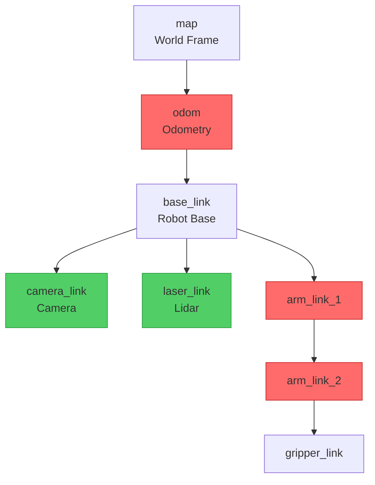

# Lesson 5: TF2 Basics

## Learning Objectives

By the end of this lesson, you will be able to:
- Explain what TF2 is and why it's essential in robotics
- Understand coordinate frames and transformations
- Identify the difference between static and dynamic transforms
- Understand the TF tree structure
- Recognize when to use TF2 in robot applications
- Visualize transform relationships

## Introduction

Imagine your robot has:
- A camera on top seeing "object at (10, 5) in camera coordinates"
- A base at ground level
- A gripper at the end of an arm

**Question**: Where is the object relative to the gripper?

You need to transform coordinates between frames. Doing this manually for every sensor is error-prone and unscalable. **TF2** solves this automatically.

## What is TF2?

**TF2 (Transform Library 2)** is a ROS2 framework that:
1. Tracks relationships between coordinate frames
2. Transforms points/vectors between frames
3. Handles time-synchronized transformations
4. Maintains a tree of all frames in the system

Think of TF2 as a "coordinate translator" that automatically converts between any two frames in your robot.

## Python Comparison

**NumPy Coordinate Transform** (manual):
```python
import numpy as np

# Manual transformation
camera_point = np.array([10, 5, 0])  # Point in camera frame

# Need to know: camera position relative to base, rotation, etc.
camera_to_base_translation = np.array([0.5, 0, 1.0])
camera_to_base_rotation = rotation_matrix(45)  # 45 degrees

# Manual calculation
base_point = camera_to_base_rotation @ camera_point + camera_to_base_translation

# Now need base to gripper transform...
# Then gripper transform...
# Gets complicated fast!
```

**TF2** (automatic):
```cpp
// TF2 handles all the math
geometry_msgs::msg::PointStamped point_in_camera;
point_in_camera.header.frame_id = "camera";
point_in_camera.point.x = 10.0;
point_in_camera.point.y = 5.0;

// Automatic transformation!
auto point_in_gripper = tf_buffer->transform(point_in_camera, "gripper");
// TF2 automatically chains: camera → base → arm → gripper
```

## Coordinate Frames

### What is a Frame?

A **coordinate frame** (or **reference frame**) is a position + orientation in 3D space.

```
      Z (up)
      |
      |
      +---- X (forward)
     /
    Y (left)
```

### Common Frames in Robotics

1. **world** / **map**: Fixed global frame
2. **odom**: Odometry frame (can drift)
3. **base_link**: Robot's base center
4. **base_footprint**: Projection of base on ground
5. **camera_link**: Camera sensor
6. **laser_link**: Lidar sensor
7. **gripper_link**: End effector

### Example Robot Frame Tree

```
world
 └─ odom
     └─ base_footprint
         └─ base_link
             ├─ camera_link
             ├─ laser_link
             └─ arm_base
                 └─ arm_link_1
                     └─ arm_link_2
                         └─ gripper_link
```

**Key Point**: This is a **tree**, not a graph. Each frame has exactly one parent.

## Transformations

A **transformation** describes the relationship between two frames:

### Translation + Rotation

```cpp
// Transform from frame A to frame B consists of:
geometry_msgs::msg::TransformStamped transform;
transform.header.frame_id = "parent_frame";
transform.child_frame_id = "child_frame";

// Translation (position offset)
transform.transform.translation.x = 1.0;  // 1m forward
transform.transform.translation.y = 0.5;  // 0.5m left
transform.transform.translation.z = 0.2;  // 0.2m up

// Rotation (as quaternion)
transform.transform.rotation.x = 0.0;
transform.transform.rotation.y = 0.0;
transform.transform.rotation.z = 0.707;  // 90 degrees around Z
transform.transform.rotation.w = 0.707;
```

**Quaternion**? Don't worry—use helper functions to convert from Euler angles (roll, pitch, yaw).

## Static vs Dynamic Transforms

### Static Transforms

**Definition**: Relationships that never change.

**Examples**:
- Camera mounted on robot base (fixed position)
- Lidar attached to chassis (fixed)
- Link-to-link relationships in robot arm (except joint angles)

**How to publish**:
```bash
# Command-line static transform
ros2 run tf2_ros static_transform_publisher \
    0.5 0 1.0 0 0 0 base_link camera_link
    # x y z roll pitch yaw parent child
```

### Dynamic Transforms

**Definition**: Relationships that change over time.

**Examples**:
- Robot moving in world (base_link → odom)
- Rotating joint (link1 → link2)
- Opening gripper (gripper_left → gripper_right)

**How to publish**: Programmatically (see Lesson 6)

## TF2 in ROS2 Context

### Why TF2 Matters

**Without TF2**:
```cpp
// Manual transformation (brittle, error-prone)
Point camera_point = get_camera_detection();

// Hardcoded transforms (breaks when robot changes)
Point base_point;
base_point.x = camera_point.x + 0.5;  // Camera offset
base_point.y = camera_point.y;
base_point.z = camera_point.z + 1.0;
// What about rotation? Time sync? Moving frames?
```

**With TF2**:
```cpp
// Automatic, handles rotation, time, chain of frames
auto point_in_base = tf_buffer->transform(point_in_camera, "base_link");
// Works even if camera moves or robot configuration changes!
```

### Real-World Use Cases

1. **Perception**:
   - Camera detects object → Transform to robot frame → Plan grasp
   - Lidar sees obstacle → Transform to map → Update occupancy grid

2. **Manipulation**:
   - Query end-effector position → Compute joint angles
   - Track object position as arm moves

3. **Navigation**:
   - Transform laser scans to map frame
   - Localize robot (update odom → map transform)

4. **Sensor Fusion**:
   - Merge data from multiple sensors in different frames
   - Example: Camera + Lidar point cloud alignment

## TF Tree Structure



- **Green**: Static (fixed relationships)
- **Red**: Dynamic (change over time)

## Querying Transformations

### Basic Query

```cpp
// Get transform from source to target frame
geometry_msgs::msg::TransformStamped transform_stamped;
try {
    transform_stamped = tf_buffer->lookupTransform(
        "target_frame",  // Transform TO this frame
        "source_frame",  // FROM this frame
        tf2::TimePointZero);  // Latest available
} catch (tf2::TransformException & ex) {
    RCLCPP_ERROR(node->get_logger(), "Transform failed: %s", ex.what());
}
```

### Transforming Points

```cpp
// Create point in source frame
geometry_msgs::msg::PointStamped point_in_camera;
point_in_camera.header.frame_id = "camera_link";
point_in_camera.header.stamp = node->now();
point_in_camera.point.x = 10.0;
point_in_camera.point.y = 5.0;
point_in_camera.point.z = 2.0;

// Transform to target frame
geometry_msgs::msg::PointStamped point_in_base;
try {
    point_in_base = tf_buffer->transform(point_in_camera, "base_link");
    RCLCPP_INFO(node->get_logger(), "Point in base: (%.2f, %.2f, %.2f)",
                point_in_base.point.x, point_in_base.point.y, point_in_base.point.z);
} catch (tf2::TransformException & ex) {
    RCLCPP_ERROR(node->get_logger(), "Transform failed: %s", ex.what());
}
```

## Time and TF2

**Critical Concept**: Transforms are **time-stamped**.

```cpp
// Get transform at CURRENT time
auto transform_now = tf_buffer->lookupTransform("base", "camera", tf2::TimePointZero);

// Get transform at SPECIFIC time (e.g., when sensor reading was taken)
rclcpp::Time sensor_time = msg->header.stamp;
auto transform_then = tf_buffer->lookupTransform("base", "camera", sensor_time);
```

**Why?** For moving frames, the transform depends on **when** you ask.
- Robot at t=0: base_link at (0, 0)
- Robot at t=10: base_link at (5, 3)

## Common Pitfalls

### 1. Forgetting Frame IDs

```cpp
// BAD: No frame information
geometry_msgs::msg::Point point;
point.x = 10.0;
// Which frame is this in? Camera? Base? World?
```

```cpp
// GOOD: Always use Stamped messages with frame_id
geometry_msgs::msg::PointStamped point;
point.header.frame_id = "camera_link";
point.header.stamp = node->now();
point.point.x = 10.0;
```

### 2. Ignoring Timestamps

```cpp
// BAD: Using current time for old sensor data
point.header.stamp = node->now();  // Wrong!
// Sensor reading was 0.5 seconds ago
```

```cpp
// GOOD: Use sensor's timestamp
point.header.stamp = sensor_msg->header.stamp;
```

### 3. Not Handling Exceptions

```cpp
// BAD: Transform can fail!
auto transform = tf_buffer->lookupTransform("base", "camera", tf2::TimePointZero);
// Crashes if transform doesn't exist
```

```cpp
// GOOD: Always use try-catch
try {
    auto transform = tf_buffer->lookupTransform("base", "camera", tf2::TimePointZero);
} catch (tf2::TransformException & ex) {
    RCLCPP_ERROR(node->get_logger(), "TF Error: %s", ex.what());
    return;  // Handle error
}
```

### 4. Creating Cycles in TF Tree

```cpp
// BAD: Creates cycle (tree becomes graph)
// base → camera AND camera → base
// TF tree must be acyclic!
```

**Rule**: Each frame has exactly ONE parent.

## Best Practices

1. **Use Standard Frame Names**
   - `map`, `odom`, `base_link`, `base_footprint`
   - Follow [REP-105](https://www.ros.org/reps/rep-0105.html) conventions

2. **Always Timestamp Messages**
   - Use sensor's original timestamp
   - Don't replace with `now()` unless appropriate

3. **Handle Transform Failures**
   - Always use try-catch
   - Log errors for debugging
   - Provide fallback behavior

4. **Keep Tree Shallow**
   - Deep trees (>10 levels) slow down lookups
   - TF searches from source to target through tree

5. **Publish Transforms Regularly**
   - At least 10 Hz for dynamic transforms
   - Static transforms published once (or use static_transform_publisher)

## Visualizing TF in RViz

```bash
# Terminal 1: Run your ROS2 system with TF publishers
ros2 run my_package my_robot

# Terminal 2: Launch RViz
rviz2

# In RViz:
# 1. Add → TF display
# 2. Set Fixed Frame to "map" or "base_link"
# 3. See all frames and their relationships
```

You'll see coordinate axes for each frame, showing their positions and orientations.

## TF Command-Line Tools

```bash
# View TF tree
ros2 run tf2_tools view_frames

# Echo a specific transform
ros2 run tf2_ros tf2_echo base_link camera_link

# Monitor TF performance
ros2 run tf2_ros tf2_monitor

# List all frames
ros2 topic echo /tf --no-arr
```

## Summary

TF2 is the coordinate transformation framework in ROS2:

**Key Concepts**:
- **Frames**: Coordinate systems (base_link, camera_link, etc.)
- **Transforms**: Translation + Rotation between frames
- **TF Tree**: Hierarchical structure of all frames
- **Static**: Fixed relationships (camera on robot)
- **Dynamic**: Changing relationships (moving robot, rotating joint)

**Why It Matters**:
- Automatically converts between coordinate frames
- Handles time synchronization
- Scales to complex robots (dozens of frames)
- Essential for perception, navigation, manipulation

**Core Operations**:
1. Publish transforms (Lesson 6)
2. Listen to transforms (Lesson 7)
3. Query transform between any two frames
4. Transform points/poses between frames

## What's Next?

You now understand **what** TF2 is and **why** it's essential. The next lessons show **how** to use it:

- **Lesson 6**: Broadcasting Transformations - Publish static and dynamic transforms
- **Lesson 7**: Listening to Transformations - Query and use transforms in your code
- **Lesson 8**: TF2 Advanced - Time travel, complex queries, debugging

## Further Reading

- [TF2 Documentation](https://docs.ros.org/en/humble/Concepts/About-Tf2.html)
- [REP-105: Coordinate Frames](https://www.ros.org/reps/rep-0105.html)
- [TF2 Tutorials](https://docs.ros.org/en/humble/Tutorials/Intermediate/Tf2/Tf2-Main.html)

---

**Practice**: Draw the TF tree for a mobile robot with:
- Base
- 2 Wheels
- Camera on top
- Lidar in front
- Gripper arm with 2 joints

Identify which transforms would be static vs dynamic.

**Next Lesson**: [Lesson 6: Broadcasting Transformations](06-broadcasting-transformations.md)
