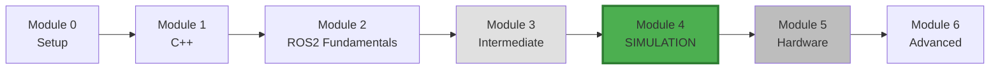
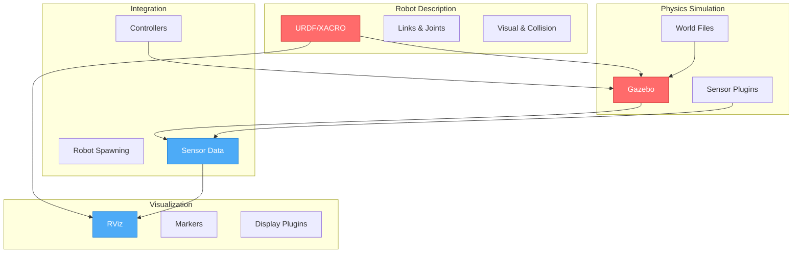
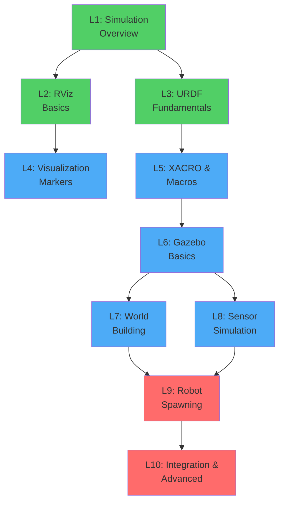
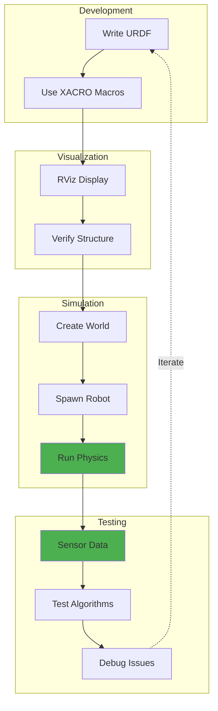

# Module 4: Simulation with Gazebo and RViz

## Module Overview

Master robot simulation and visualization in ROS2 using Gazebo (physics simulation) and RViz (3D visualization). Learn to create robot models, simulate sensors, build worlds, and test algorithms in realistic virtual environments before deploying to hardware.

## Why Simulation Matters

**Simulation enables**:
- 🧪 **Safe Testing**: Test dangerous scenarios without risk
- 💰 **Cost Savings**: Develop without expensive hardware
- ⚡ **Rapid Iteration**: Faster development cycles
- 🔄 **Reproducibility**: Identical test conditions every time
- 📊 **Data Generation**: Training data for machine learning
- 🌍 **Scalability**: Test multiple robots simultaneously

## Module Position in Learning Journey

## What You'll Learn (Conceptual Overview)

### Core Concepts Map

### Conceptual Breakdown

#### RViz (Robot Visualization)

**What it is:**
3D visualization tool for displaying robot state, sensor data, and planning information in real-time.

**What it does/needed for:**
- Visualize robot models (URDF) in 3D space
- Display sensor data (laser scans, point clouds, images)
- Show transform trees (TF)
- Debug robot behavior visually
- Interactive markers for control

**Why it matters:**
Without visualization, debugging robots is like flying blind. RViz lets you see what your robot "sees" and understand its internal state. Critical for development and debugging.

**How it connects:**
- **Builds on**: TF2 (Module 3), topics and messages (Module 2)
- **Used by**: All robotics development and debugging
- **Related to**: Gazebo visualization, debugging tools
- **Prepares for**: Hardware debugging, sensor integration (Module 5)

---

#### URDF (Unified Robot Description Format)

**What it is:**
XML-based format describing robot kinematics, dynamics, visual appearance, and collision properties.

**What it does/needed for:**
- Define robot structure (links and joints)
- Specify physical properties (mass, inertia)
- Describe visual appearance (meshes, colors)
- Set collision geometry for physics
- Enable coordinate frame transformations

**Why it matters:**
URDF is the universal robot description language. Without it, simulators and visualization tools can't understand your robot's structure. It's the blueprint that brings your robot to life in software.

**How it connects:**
- **Builds on**: XML syntax, coordinate frames
- **Used by**: RViz, Gazebo, MoveIt, robot_state_publisher
- **Related to**: XACRO (macro language for URDF), SDF (Simulation Description Format)
- **Prepares for**: Real robot control, motion planning

---

#### Gazebo (Physics Simulation)

**What it is:**
High-fidelity 3D robot simulator with accurate physics, rendering, and sensor simulation.

**What it does/needed for:**
- Simulate robot dynamics and physics
- Model sensor behavior (lidar, cameras, IMU)
- Create virtual environments (worlds)
- Test algorithms before hardware deployment
- Generate training data

**Why it matters:**
Hardware is expensive and breaks. Gazebo lets you test dangerous scenarios, edge cases, and failure modes safely. It's your risk-free robotics laboratory.

**How it connects:**
- **Builds on**: URDF models, ROS2 topics
- **Used by**: Algorithm testing, ML training, integration testing
- **Related to**: RViz (visualization), controllers (actuation)
- **Prepares for**: Hardware deployment with confidence

---

#### Sensor Simulation

**What it is:**
Virtual sensors in Gazebo that mimic real sensor behavior (noise, latency, field-of-view).

**What it does/needed for:**
- Simulate lidar, cameras, depth sensors
- Add realistic noise and artifacts
- Model sensor limitations
- Generate synthetic data
- Test perception algorithms

**Why it matters:**
Algorithms that work with perfect data fail on real sensors. Simulated sensors with realistic noise prepare your code for the real world.

**How it connects:**
- **Builds on**: Gazebo physics, URDF sensor descriptions
- **Used by**: Perception pipelines, SLAM, object detection
- **Related to**: Sensor drivers (Module 5)
- **Prepares for**: Real sensor integration and calibration

---

## Learning Objectives

By the end of this module, you will be able to:

### RViz & Visualization
- [ ] Configure RViz displays for robot visualization
- [ ] Create and publish visualization markers
- [ ] Use interactive markers for robot control
- [ ] Debug with RViz tools (TF, camera, laser)

### URDF & Robot Description
- [ ] Write URDF files for robots
- [ ] Define links, joints, and coordinate frames
- [ ] Use XACRO for modular robot descriptions
- [ ] Set visual and collision properties

### Gazebo Simulation
- [ ] Create Gazebo worlds and environments
- [ ] Spawn robots in simulation
- [ ] Configure sensor plugins
- [ ] Simulate physics and dynamics

### Integration
- [ ] Launch RViz + Gazebo together
- [ ] Integrate simulated sensors with ROS2
- [ ] Control simulated robots
- [ ] Test real algorithms in simulation

## Module Structure

### Lessons Overview

### Detailed Lesson List

1. **[Simulation Overview](lessons/01-simulation-overview.md)** (~30 min)
   - Why simulate robots
   - RViz vs Gazebo
   - Simulation workflow
   - **Builds on**: ROS2 fundamentals
   - **Prepares for**: Tool selection

2. **[RViz Basics](lessons/02-rviz-basics.md)** (~45 min)
   - RViz interface and displays
   - Robot model visualization
   - TF display and debugging
   - **Builds on**: TF2 (Module 3)
   - **Prepares for**: Visual debugging

3. **[URDF Fundamentals](lessons/03-urdf-fundamentals.md)** (~60 min)
   - XML structure
   - Links and joints
   - Visual and collision geometry
   - **Builds on**: Coordinate frames
   - **Prepares for**: Robot descriptions

4. **[Visualization Markers](lessons/04-visualization-markers.md)** (~45 min)
   - Marker types and shapes
   - Publishing markers
   - Interactive markers
   - **Builds on**: Publishers (Module 2)
   - **Prepares for**: Custom visualizations

5. **[XACRO and Macros](lessons/05-xacro-macros.md)** (~45 min)
   - XACRO syntax
   - Parameters and properties
   - Macros for reusable components
   - **Builds on**: URDF
   - **Prepares for**: Modular robots

6. **[Gazebo Basics](lessons/06-gazebo-basics.md)** (~60 min)
   - Gazebo interface
   - Starting simulation
   - Basic physics
   - **Builds on**: URDF models
   - **Prepares for**: Physics simulation

7. **[World Building](lessons/07-world-building.md)** (~45 min)
   - SDF world files
   - Adding models and obstacles
   - Lighting and environment
   - **Builds on**: Gazebo basics
   - **Prepares for**: Test environments

8. **[Sensor Simulation](lessons/08-sensor-simulation.md)** (~60 min)
   - Lidar/laser plugins
   - Camera simulation
   - IMU and depth sensors
   - **Builds on**: URDF, Gazebo
   - **Prepares for**: Perception testing

9. **[Robot Spawning and Control](lessons/09-robot-spawning.md)** (~60 min)
   - Spawning entities
   - ros2_control integration
   - Joint controllers
   - **Builds on**: Launch files (Module 3)
   - **Prepares for**: Simulated control

10. **[Simulation Integration](lessons/10-simulation-integration.md)** (~45 min)
    - Complete simulation setup
    - RViz + Gazebo workflow
    - Testing real code
    - **Builds on**: All previous lessons
    - **Prepares for**: Hardware deployment

**Total Lesson Time**: ~8 hours

### Code Examples

| Package | Description | Nodes/Files | Key Concepts |
|---------|-------------|-------------|--------------|
| **rviz_example** | RViz displays and markers | 3 nodes | Visualization, markers, interactive |
| **urdf_example** | Robot descriptions | 4 URDF/XACRO files | Links, joints, macros |
| **gazebo_example** | Simulation worlds | 3 worlds, 2 robots | Physics, sensors, plugins |
| **sim_integration** | Complete simulation | Launch files, controllers | Full integration |

**Total**: 4 packages with complete simulation setups

### Exercises

| Exercise | Focus | Time | Difficulty |
|----------|-------|------|------------|
| **1. Robot Visualizer** | Create URDF and visualize | 3-4 hrs | ⭐⭐ |
| **2. Gazebo Environment** | Build world, spawn robot | 4-5 hrs | ⭐⭐⭐ |
| **3. Sensor Integration** | Simulate sensors, process data | 4-5 hrs | ⭐⭐⭐ |

**Total**: 3 exercises with starter and solution code

### Mini-Project: Mobile Robot Simulation

**Complete simulation environment** for differential drive robot:
- Custom URDF with sensors (lidar, camera, IMU)
- Gazebo world with obstacles
- RViz visualization
- Teleoperation and autonomous navigation
- Sensor data processing

**Integration**: Combines all Module 4 concepts

**Time**: 15-20 hours

---

## How Concepts Work Together

### Typical Workflow

1. **Design**: Write URDF/XACRO for robot
2. **Visualize**: Check in RViz (no physics)
3. **Simulate**: Load in Gazebo (with physics)
4. **Test**: Run algorithms on simulated data
5. **Debug**: Use RViz to visualize issues
6. **Iterate**: Refine and repeat
7. **Deploy**: Move to real hardware (Module 5)

---

## Connection to Previous Modules

### From Module 2 (ROS2 Fundamentals)
- **Topics**: Sensor data flows through topics
- **Publishers**: Sensors publish simulated data
- **Subscribers**: Your code subscribes to sim data
- **Messages**: Same message types as real sensors

### From Module 3 (ROS2 Intermediate)
- **TF2**: URDF generates transform tree
- **Launch Files**: Start simulation systems
- **Actions**: Control robot goals in simulation

---

## Connection to Next Modules

### To Module 5 (Hardware Integration)
- **Sensor Drivers**: Same interface as simulated sensors
- **Robot Control**: Test controllers before hardware
- **Debugging**: Sim debugging transfers to hardware

### To Module 6 (ROS2 Advanced)
- **Lifecycle**: Manage simulation node states
- **QoS**: Configure simulation data flow
- **Performance**: Profile algorithms in simulation

---

## Conceptual Bridges

### From Module 3 → Module 4

**You learned**: Actions, TF2, Launch Files
**Now**: Apply to virtual robots before real ones

**Bridge**: The robot arm from Module 3 mini-project can now be visualized in RViz and simulated in Gazebo. Same code, zero hardware risk!

### From Module 4 → Module 5

**You'll learn**: Real sensor integration
**Foundation**: Simulation tests algorithms safely first

**Bridge**: Code developed for simulated lidar works unchanged with real lidar. Simulation de-risks hardware development.

---

## Critical Concepts to Master

### 🔴 Must Master (Used Everywhere)

1. **URDF Structure**: Foundation of robot description
   - Verify: Can you write a 2-link robot URDF from scratch?

2. **RViz Configuration**: Essential debugging tool
   - Verify: Can you visualize robot state and sensor data?

3. **Gazebo Launch**: Start simulation environments
   - Verify: Can you spawn a robot and run physics?

### 🔵 Important (Frequently Used)

4. **XACRO Macros**: Reusable robot components
   - Verify: Can you parameterize a robot description?

5. **Sensor Plugins**: Simulate perception
   - Verify: Can you add lidar/camera to robot?

6. **World Files**: Create test environments
   - Verify: Can you build a custom Gazebo world?

---

## Common Questions

**Q: RViz vs Gazebo - when to use which?**
**A**:
- **RViz**: Visualization only, no physics. Use for debugging state, seeing data, checking TF.
- **Gazebo**: Full physics simulation. Use for testing algorithms, sensor behavior, dynamics.
- **Together**: Common workflow - Gazebo generates data, RViz visualizes it.

**Q: Do I need to learn URDF if I'm using Gazebo?**
**A**: YES! URDF describes your robot structure. Both RViz and Gazebo read URDF to understand your robot. It's the universal robot language.

**Q: Can I use my Module 3 code in simulation?**
**A**: Absolutely! That's the power of ROS2. Your action servers, TF listeners, and launch files work identically with simulated or real robots.

**Q: Will simulation results match real hardware?**
**A**: Close, but not perfect. Simulation helps test logic and algorithms, but real hardware has friction, noise, and delays not fully modeled. Always validate on hardware.

**Q: Do I need to know physics?**
**A**: Basic understanding helps (mass, inertia, friction), but Gazebo handles the complex math. You specify properties, it computes dynamics.

**Q: Can I simulate multiple robots?**
**A**: Yes! Gazebo supports multiple robots. Use namespaces (Module 3) to keep them separate.

---

## Module Checklist

Before moving to Module 5, ensure you can:

### RViz
- [ ] Launch RViz with configuration file
- [ ] Add and configure displays (RobotModel, TF, LaserScan)
- [ ] Visualize topics and transforms
- [ ] Create and publish markers
- [ ] Use interactive markers

### URDF
- [ ] Write basic URDF with links and joints
- [ ] Define visual and collision geometry
- [ ] Set mass and inertia properties
- [ ] Use XACRO for parameters and macros
- [ ] Launch robot_state_publisher

### Gazebo
- [ ] Start Gazebo with custom world
- [ ] Spawn robot from URDF/XACRO
- [ ] Configure sensor plugins (lidar, camera)
- [ ] Run physics simulation
- [ ] Interface with ROS2 topics

### Integration
- [ ] Launch RViz + Gazebo together
- [ ] Visualize simulated sensor data
- [ ] Control simulated robot
- [ ] Test algorithms in simulation
- [ ] Debug using visualization

---

## Verification Questions

Test your understanding before Module 5:

1. **URDF**: What's the difference between a link and a joint?
2. **Visualization**: How do you display a laser scan in RViz?
3. **Simulation**: What's the purpose of collision geometry vs visual geometry?
4. **Sensors**: How do Gazebo sensor plugins publish data?
5. **Integration**: How does robot_state_publisher relate to URDF and TF?

**Answers in lessons and examples!**

---

## What's Next?

### After Module 4

**You'll be able to**:
- ✅ Visualize any robot in RViz
- ✅ Create realistic simulation environments
- ✅ Test algorithms safely before hardware
- ✅ Debug with powerful visual tools
- ✅ Generate synthetic sensor data

**Next Module**: Hardware Integration
→ Apply simulation skills to real robots
→ Same code, real sensors!

---

**Module 4 Learning Path**: Theory → Visualization → Description → Simulation → Integration → Hardware Ready!

Good luck! You're about to enter the virtual robotics laboratory! 🤖🌐
